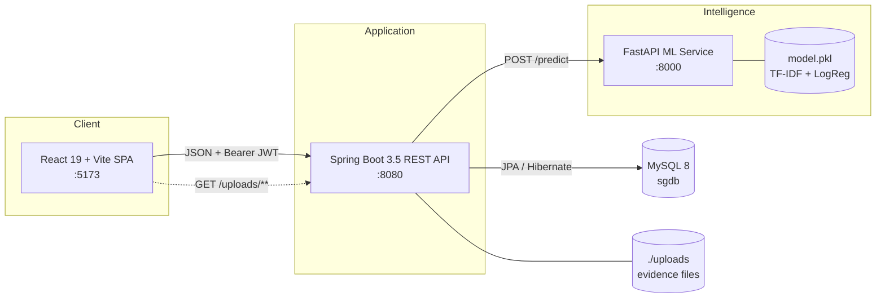
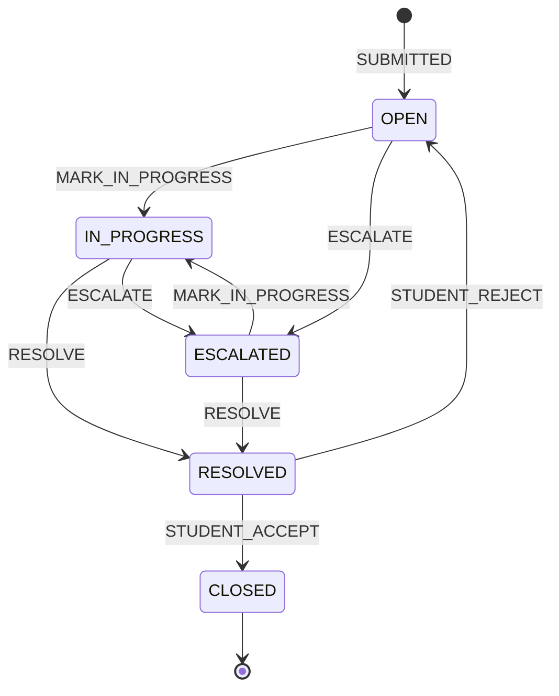
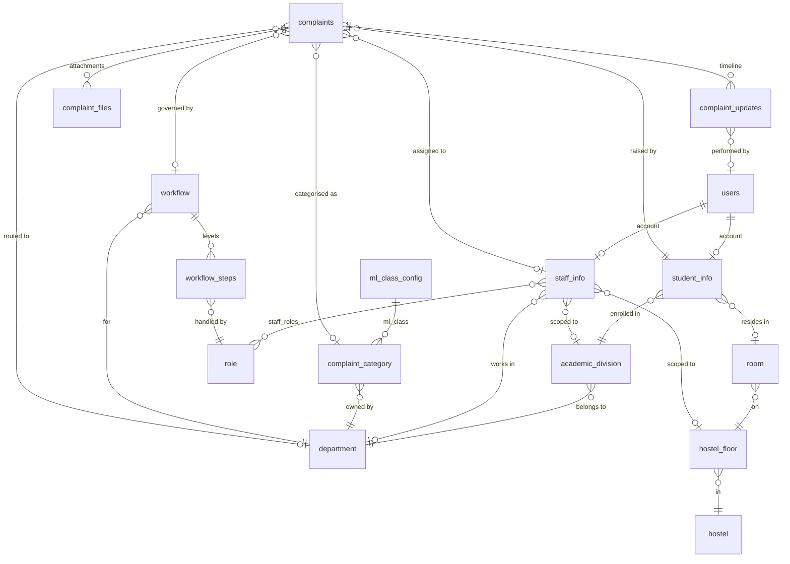

<div align="center">

# Smart Grievance Management System (SGMS)

**An ML-assisted grievance management platform for educational institutions.**

Students file complaints in plain language. A machine-learning classifier routes each complaint to the
right department, a configurable workflow engine assigns it to the right staff member, and every
action is recorded on an immutable audit timeline.

[](https://openjdk.org/projects/jdk/17/)
[](https://spring.io/projects/spring-boot)
[](https://react.dev/)
[](https://vite.dev/)
[](https://fastapi.tiangolo.com/)
[](https://scikit-learn.org/)
[](https://www.mysql.com/)

</div>

---

## Table of Contents

- [Overview](#overview)
- [Features](#features)
- [Architecture](#architecture)
- [Tech Stack](#tech-stack)
- [Repository Structure](#repository-structure)
- [Getting Started](#getting-started)
- [Configuration](#configuration)
- [API Reference](#api-reference)
- [ML Service](#ml-service)
- [Complaint Lifecycle](#complaint-lifecycle)
- [Data Model](#data-model)
- [Security Model](#security-model)
- [Testing](#testing)
- [Known Limitations](#known-limitations)
- [Roadmap](#roadmap)
- [Contributing](#contributing)
- [License](#license)

---

## Overview

Traditional grievance handling in colleges is manual: a student submits a form, a clerk decides which
department owns it, and the complaint disappears into an inbox with no visible status. SGMS replaces
that with a three-tier system:

1. **Classification** — a TF‑IDF + Logistic Regression model reads the complaint title and description
   and predicts an *ML class* (`HOSTEL`, `ACADEMIC`, `EXAM`, `LIBRARY`, `MEDICAL`, `TRANSPORT`,
   `SPORTS`, `ADMIN`) with a real confidence score.
2. **Resolution** — the backend resolves that class into a concrete `complaint_category` row using
   database-driven rules (`ml_class_config`), never hardcoded names. Low-confidence predictions fall
   back to explicit student selection.
3. **Routing & escalation** — each department owns a versioned workflow of levels. Every level names a
   role and an assignment scope (`DIVISION`, `DEPARTMENT`, `FLOOR`, `GLOBAL`), so the system can pick
   the exact staff member responsible — the warden of *that* hostel floor, the HOD of *that* division —
   and escalate up the chain when a level does not resolve in time.

Design principles that the codebase enforces:

- **The database is the single source of truth.** Category names, departments, ML class mappings and
  workflows are all data, not constants. Adding a department is a configuration change, not a release.
- **Degrade gracefully, never lose a complaint.** If the ML service is down, if no workflow is
  configured, or if no staff match the assignment scope, the complaint is still created and persisted —
  it simply stays unassigned and is visible to admins.
- **Everything is auditable.** Status transitions, escalations, admin overrides, staff reassignments and
  student accept/reject decisions are all appended to `complaint_updates` with actor, from-status,
  to-status and note.

---

## Features

### Student

- Submit a complaint with title, description, optional priority and up to five evidence files
  (JPEG / PNG / GIF / PDF, 5 MB each).
- **Live category suggestion** — request an ML prediction before submitting; the suggested category is
  auto-selected only when the model is confident, otherwise the student picks from the active category
  list.
- Track every complaint through its full status timeline.
- **Accept or reject a resolution.** Accepting closes the complaint; rejecting reopens it for the
  assigned staff member.

### Staff

- Dashboard of complaints assigned to *you* (scope-aware — enforced server-side, not just in the UI).
- Move a complaint to *In Progress*, resolve it, or attach a note — every action requires an audit note
  payload.
- **Escalate** to the next workflow level when the issue is outside your authority.

### Administrator

- Dashboard with live counts: students, staff, total / active / resolved / closed complaints.
- **Complaint oversight** — list all complaints, filter by status, priority or department; override a
  misrouted department (with a mandatory reason) and reassign staff manually.
- **Student & staff management** — provision accounts (created with a temporary password that the user
  must replace on first sign-in), update profiles, disable accounts.
- **Departments & categories** — create, update, activate/deactivate; bind a category to an ML class.
- **Workflow builder** — create versioned workflows per department, add/edit/delete levels with role and
  SLA (`resolutionTimeHours`), then activate a version atomically.

---

## Architecture



**Request path for a new complaint**

```
Student submits (multipart)
        │
        ├─ categoryId provided? ──► validate category + department are active   (no ML call)
        │
        └─ not provided? ────────► POST ml-service /predict
                                        │
                                        ├─ high_confidence ──► ml_class_config lookup
                                        │                      ├─ STUDENT_DEPT  → category of student's division
                                        │                      └─ DIRECT_SINGLE → the one active category for that class
                                        └─ low / unavailable ─► student must choose manually
        │
        ├─ resolve department from category
        ├─ load active workflow for department        (missing → complaint stays unassigned)
        ├─ assign staff for level 1 by role scope     (no match → complaint stays unassigned)
        ├─ persist complaint + ML audit metadata (predicted class, confidence, predicted priority)
        ├─ store evidence files
        └─ append SUBMITTED entry to the timeline
```

---

## Tech Stack

| Layer | Technology | Notes |
|---|---|---|
| Frontend | React 19, Vite 7, React Router 7 | SPA, `@` path alias to `src/` |
| UI | Tailwind CSS 4, shadcn/ui, Radix UI, Lucide, Framer Motion, Sonner | Component primitives under `src/components/ui` |
| HTTP client | Axios | Interceptors inject the JWT and force logout on `401` |
| Backend | Spring Boot 3.5.10, Java 17 | Web, Data JPA, Validation, Security |
| Auth | JJWT 0.11.5, BCrypt | Stateless HS256 tokens, 24 h default TTL |
| API docs | springdoc-openapi 2.7.0 | Bearer-auth security scheme pre-configured |
| Database | MySQL 8 + Hibernate | `ddl-auto=validate` — schema is managed outside the app |
| ML service | FastAPI 0.109, Uvicorn, Pydantic 2 | Two endpoints: `/health`, `/predict` |
| ML model | scikit-learn — TF‑IDF (1–2 grams) → Logistic Regression (`C=5.0`) | Persisted with joblib as `model.pkl` |
| Build | Maven Wrapper, npm, pip | |

---

## Repository Structure

```
smart-grievance-system/
├── backend/sgms-backend/            Spring Boot REST API
│   └── src/main/java/com/sgms/sgms_backend/
│       ├── config/                  Swagger + static upload resource handler
│       ├── controller/              16 REST controllers
│       ├── dto/                     Request/response payloads (grouped by domain)
│       ├── enums/                   ComplaintStatus, ComplaintAction, Priority, AssignmentScope, …
│       ├── exception/               Typed exceptions + @RestControllerAdvice
│       ├── model/                   17 JPA entities
│       ├── repository/              Spring Data repositories
│       ├── security/                JwtFilter, JwtUtil, SecurityConfig, CorsConfig
│       └── service/
│           ├── assignment/          Scope-based staff selection
│           ├── resolution/          ML class → category resolution
│           ├── workflow/            Workflow + step lookup
│           ├── timeline/            Audit trail writer
│           └── impl/                Service implementations
├── frontend/                        React + Vite SPA
│   └── src/
│       ├── components/              admin/, complaints/, dashboard/, ui/
│       ├── context/UserContext.jsx  Session bootstrap via /auth/me
│       ├── pages/                   Dashboards, complaint flow, admin/ management screens
│       ├── routes/                  AppRoutes + role-aware ProtectedRoute
│       └── services/                One Axios module per API surface
├── ml-service/                      FastAPI classification microservice
│   ├── main.py                      HTTP layer (/health, /predict)
│   ├── model.py                     Lazy-loaded inference + confidence gating
│   ├── preprocess.py                Shared text pipeline (train == inference)
│   ├── train.py                     Train, evaluate, persist model.pkl
│   ├── dataset.csv                  10,315-row seed dataset (8 classes)
│   ├── test_model.py, diagnose.py   Manual prediction smoke scripts
│   └── requirements.txt
├── database/sgms.sql                Legacy schema fragment — see Getting Started
└── docs/                            Documentation
```

---

## Getting Started

### Prerequisites

| Tool | Version |
|---|---|
| JDK | 17+ |
| Node.js | 20+ (npm 10+) |
| Python | 3.10+ |
| MySQL | 8.0+ |

### 1. Clone

```bash
git clone https://github.com/your-username/smart-grievance-system.git
```

### 2. Database

Create the database:

```bash
mysql -u root -p -e "CREATE DATABASE IF NOT EXISTS sgdb CHARACTER SET utf8mb4;"
```

> **Note on the schema.** The backend runs with `spring.jpa.hibernate.ddl-auto=validate`, which
> requires the schema to already match the JPA entities — Hibernate will not create it. The committed
> `database/sgms.sql` is an early fragment (only `student_info` and `staff_info`) and does **not** match
> the current entity model. To generate a schema for local development, start the backend once with
> `-Dspring.jpa.hibernate.ddl-auto=update`, then dump it and switch back to `validate`:
>
> ```bash
> mysqldump --no-data -u root -p sgdb > database/schema.sql
> ```
<svg xmlns="http://www.w3.org/2000/svg" width="1588" height="1625" viewBox="0 0 1588 1625" font-family="Segoe UI, Inter, Helvetica, Arial, sans-serif">
<rect width="1588" height="1625" fill="#FFFFFF"/>
<text x="78" y="34" font-size="26" font-weight="700" fill="#0F172A">Smart Grievance Management System</text>
<text x="78" y="58" font-size="13" fill="#64748B">Entity-Relationship Diagram · current schema, derived from the JPA entity model · MySQL 8</text>
<line x1="78" y1="74" x2="1498" y2="74" stroke="#E2E8F0"/>
<rect x="64" y="186" width="296" height="540" rx="12" fill="#EFF6FF" stroke="#BFDBFE"/>
<text x="78" y="205" font-size="12" font-weight="700" letter-spacing="0.6" fill="#1D4ED8">HOSTEL &amp; LOCATION</text>
<rect x="64" y="730" width="296" height="354" rx="12" fill="#ECFDF5" stroke="#A7F3D0"/>
<text x="78" y="749" font-size="12" font-weight="700" letter-spacing="0.6" fill="#047857">ORGANIZATION</text>
<rect x="448" y="186" width="296" height="1110" rx="12" fill="#F5F3FF" stroke="#DDD6FE"/>
<text x="462" y="205" font-size="12" font-weight="700" letter-spacing="0.6" fill="#6D28D9">IDENTITY &amp; ACCESS</text>
<rect x="832" y="186" width="296" height="420" rx="12" fill="#FFF7ED" stroke="#FED7AA"/>
<text x="846" y="205" font-size="12" font-weight="700" letter-spacing="0.6" fill="#C2410C">ML CLASSIFICATION</text>
<rect x="832" y="610" width="296" height="398" rx="12" fill="#FDF2F8" stroke="#FBCFE8"/>
<text x="846" y="629" font-size="12" font-weight="700" letter-spacing="0.6" fill="#BE185D">ROUTING &amp; WORKFLOW</text>
<rect x="1216" y="186" width="296" height="936" rx="12" fill="#F8FAFC" stroke="#E2E8F0"/>
<text x="1230" y="205" font-size="12" font-weight="700" letter-spacing="0.6" fill="#334155">COMPLAINTS &amp; AUDIT</text>
<polyline points="730,557.0 761,557.0 761,261.0 730,261.0" fill="none" stroke="#64748B" stroke-width="1.7"/>
<polyline points="730,853.0 776,853.0 776,261.0 730,261.0" fill="none" stroke="#64748B" stroke-width="1.7"/>
<polyline points="730,1225.0 791,1225.0 791,831.0 730,831.0" fill="none" stroke="#64748B" stroke-width="1.7"/>
<polyline points="462,1247.0 431,1247.0 431,1083.0 462,1083.0" fill="none" stroke="#64748B" stroke-width="1.7"/>
<polyline points="78,425.0 47,425.0 47,261.0 78,261.0" fill="none" stroke="#64748B" stroke-width="1.7"/>
<polyline points="78,567.0 32,567.0 32,403.0 78,403.0" fill="none" stroke="#64748B" stroke-width="1.7"/>
<polyline points="78,1035.0 47,1035.0 47,805.0 78,805.0" fill="none" stroke="#64748B" stroke-width="1.7"/>
<polyline points="462,667.0 362.0,667.0 362.0,991.0 346,991.0" fill="none" stroke="#64748B" stroke-width="1.7"/>
<polyline points="462,689.0 374.0,689.0 374.0,545.0 346,545.0" fill="none" stroke="#64748B" stroke-width="1.7"/>
<polyline points="462,941.0 386.0,941.0 386.0,991.0 346,991.0" fill="none" stroke="#64748B" stroke-width="1.7"/>
<polyline points="462,963.0 398.0,963.0 398.0,805.0 346,805.0" fill="none" stroke="#64748B" stroke-width="1.7"/>
<polyline points="462,985.0 410.0,985.0 410.0,403.0 346,403.0" fill="none" stroke="#64748B" stroke-width="1.7"/>
<polyline points="1114,491.0 1145,491.0 1145,261.0 1114,261.0" fill="none" stroke="#94A3B8" stroke-width="1.7" stroke-dasharray="7 5"/>
<polyline points="1114,893.0 1160,893.0 1160,685.0 1114,685.0" fill="none" stroke="#64748B" stroke-width="1.7"/>
<polyline points="846,915.0 746.0,915.0 746.0,1083.0 730,1083.0" fill="none" stroke="#64748B" stroke-width="1.7"/>
<polyline points="1230,327.0 1130.0,327.0 1130.0,425.0 1114,425.0" fill="none" stroke="#64748B" stroke-width="1.7"/>
<polyline points="1230,371.0 1142.0,371.0 1142.0,685.0 1114,685.0" fill="none" stroke="#64748B" stroke-width="1.7"/>
<polyline points="1498,1029.0 1529,1029.0 1529,261.0 1498,261.0" fill="none" stroke="#64748B" stroke-width="1.7"/>
<polyline points="1498,777.0 1544,777.0 1544,261.0 1498,261.0" fill="none" stroke="#64748B" stroke-width="1.7"/>
<polyline points="1230,349.0 1166.0,349.0 1166.0,96 446.0,96 446.0,805.0 346,805.0" fill="none" stroke="#64748B" stroke-width="1.7"/>
<polyline points="846,469.0 758.0,469.0 758.0,110 422.0,110 422.0,805.0 346,805.0" fill="none" stroke="#64748B" stroke-width="1.7"/>
<polyline points="846,773.0 770.0,773.0 770.0,124 434.0,124 434.0,805.0 346,805.0" fill="none" stroke="#64748B" stroke-width="1.7"/>
<polyline points="1230,283.0 1178.0,283.0 1178.0,138 794.0,138 794.0,535.0 730,535.0" fill="none" stroke="#64748B" stroke-width="1.7"/>
<polyline points="1230,305.0 1190.0,305.0 1190.0,152 806.0,152 806.0,831.0 730,831.0" fill="none" stroke="#64748B" stroke-width="1.7"/>
<polyline points="1230,799.0 1154.0,799.0 1154.0,166 782.0,166 782.0,261.0 730,261.0" fill="none" stroke="#64748B" stroke-width="1.7"/>
<rect x="78" y="220" width="268" height="96" rx="7" fill="#fff" stroke="#94A3B8" stroke-width="1.4"/>
<path d="M78 250 V227 a7 7 0 0 1 7 -7 H339 a7 7 0 0 1 7 7 V250 Z" fill="#1E293B"/>
<text x="90" y="240.0" font-size="14" font-weight="700" fill="#FFFFFF">hostel</text>
<rect x="79.4" y="250" width="265.2" height="22" fill="#FEF9C3"/>
<text x="90" y="265.5" font-size="13" font-family="Consolas, ui-monospace, monospace" fill="#713F12">hostel_id</text>
<text x="335" y="265.0" font-size="10" font-family="Consolas, ui-monospace, monospace" font-weight="700" text-anchor="end" fill="#A16207">PK</text>
<line x1="79.4" y1="272" x2="344.6" y2="272" stroke="#E2E8F0"/>
<text x="90" y="287.5" font-size="13" font-family="Consolas, ui-monospace, monospace" fill="#334155">name</text>
<line x1="79.4" y1="294" x2="344.6" y2="294" stroke="#E2E8F0"/>
<text x="90" y="309.5" font-size="13" font-family="Consolas, ui-monospace, monospace" fill="#334155">type</text>
<text x="335" y="309.0" font-size="10" font-family="Consolas, ui-monospace, monospace" font-weight="700" text-anchor="end" fill="#0F766E">ENUM</text>
<rect x="78" y="220" width="268" height="96" rx="7" fill="none" stroke="#94A3B8" stroke-width="1.4"/>
<rect x="78" y="362" width="268" height="96" rx="7" fill="#fff" stroke="#94A3B8" stroke-width="1.4"/>
<path d="M78 392 V369 a7 7 0 0 1 7 -7 H339 a7 7 0 0 1 7 7 V392 Z" fill="#1E293B"/>
<text x="90" y="382.0" font-size="14" font-weight="700" fill="#FFFFFF">hostel_floor</text>
<rect x="79.4" y="392" width="265.2" height="22" fill="#FEF9C3"/>
<text x="90" y="407.5" font-size="13" font-family="Consolas, ui-monospace, monospace" fill="#713F12">floor_id</text>
<text x="335" y="407.0" font-size="10" font-family="Consolas, ui-monospace, monospace" font-weight="700" text-anchor="end" fill="#A16207">PK</text>
<rect x="79.4" y="414" width="265.2" height="22" fill="#F1F5F9"/>
<line x1="79.4" y1="414" x2="344.6" y2="414" stroke="#E2E8F0"/>
<text x="90" y="429.5" font-size="13" font-family="Consolas, ui-monospace, monospace" fill="#334155">hostel_id</text>
<text x="335" y="429.0" font-size="10" font-family="Consolas, ui-monospace, monospace" font-weight="700" text-anchor="end" fill="#2563EB">FK</text>
<line x1="79.4" y1="436" x2="344.6" y2="436" stroke="#E2E8F0"/>
<text x="90" y="451.5" font-size="13" font-family="Consolas, ui-monospace, monospace" fill="#334155">floor_number</text>
<rect x="78" y="362" width="268" height="96" rx="7" fill="none" stroke="#94A3B8" stroke-width="1.4"/>
<rect x="78" y="504" width="268" height="184" rx="7" fill="#fff" stroke="#94A3B8" stroke-width="1.4"/>
<path d="M78 534 V511 a7 7 0 0 1 7 -7 H339 a7 7 0 0 1 7 7 V534 Z" fill="#1E293B"/>
<text x="90" y="524.0" font-size="14" font-weight="700" fill="#FFFFFF">room</text>
<rect x="79.4" y="534" width="265.2" height="22" fill="#FEF9C3"/>
<text x="90" y="549.5" font-size="13" font-family="Consolas, ui-monospace, monospace" fill="#713F12">room_id</text>
<text x="335" y="549.0" font-size="10" font-family="Consolas, ui-monospace, monospace" font-weight="700" text-anchor="end" fill="#A16207">PK</text>
<rect x="79.4" y="556" width="265.2" height="22" fill="#F1F5F9"/>
<line x1="79.4" y1="556" x2="344.6" y2="556" stroke="#E2E8F0"/>
<text x="90" y="571.5" font-size="13" font-family="Consolas, ui-monospace, monospace" fill="#334155">floor_id</text>
<text x="335" y="571.0" font-size="10" font-family="Consolas, ui-monospace, monospace" font-weight="700" text-anchor="end" fill="#2563EB">FK UK</text>
<line x1="79.4" y1="578" x2="344.6" y2="578" stroke="#E2E8F0"/>
<text x="90" y="593.5" font-size="13" font-family="Consolas, ui-monospace, monospace" fill="#334155">room_number</text>
<text x="335" y="593.0" font-size="10" font-family="Consolas, ui-monospace, monospace" font-weight="700" text-anchor="end" fill="#7C3AED">UK</text>
<line x1="79.4" y1="600" x2="344.6" y2="600" stroke="#E2E8F0"/>
<text x="90" y="615.5" font-size="13" font-family="Consolas, ui-monospace, monospace" fill="#334155">capacity</text>
<line x1="79.4" y1="622" x2="344.6" y2="622" stroke="#E2E8F0"/>
<text x="90" y="637.5" font-size="13" font-family="Consolas, ui-monospace, monospace" fill="#334155">current_occupancy</text>
<line x1="79.4" y1="644" x2="344.6" y2="644" stroke="#E2E8F0"/>
<text x="90" y="659.5" font-size="13" font-family="Consolas, ui-monospace, monospace" fill="#334155">created_at</text>
<line x1="79.4" y1="666" x2="344.6" y2="666" stroke="#E2E8F0"/>
<text x="90" y="681.5" font-size="13" font-family="Consolas, ui-monospace, monospace" fill="#334155">updated_at</text>
<rect x="78" y="504" width="268" height="184" rx="7" fill="none" stroke="#94A3B8" stroke-width="1.4"/>
<rect x="78" y="764" width="268" height="140" rx="7" fill="#fff" stroke="#94A3B8" stroke-width="1.4"/>
<path d="M78 794 V771 a7 7 0 0 1 7 -7 H339 a7 7 0 0 1 7 7 V794 Z" fill="#1E293B"/>
<text x="90" y="784.0" font-size="14" font-weight="700" fill="#FFFFFF">department</text>
<rect x="79.4" y="794" width="265.2" height="22" fill="#FEF9C3"/>
<text x="90" y="809.5" font-size="13" font-family="Consolas, ui-monospace, monospace" fill="#713F12">department_id</text>
<text x="335" y="809.0" font-size="10" font-family="Consolas, ui-monospace, monospace" font-weight="700" text-anchor="end" fill="#A16207">PK</text>
<line x1="79.4" y1="816" x2="344.6" y2="816" stroke="#E2E8F0"/>
<text x="90" y="831.5" font-size="13" font-family="Consolas, ui-monospace, monospace" fill="#334155">code</text>
<text x="335" y="831.0" font-size="10" font-family="Consolas, ui-monospace, monospace" font-weight="700" text-anchor="end" fill="#7C3AED">UK</text>
<line x1="79.4" y1="838" x2="344.6" y2="838" stroke="#E2E8F0"/>
<text x="90" y="853.5" font-size="13" font-family="Consolas, ui-monospace, monospace" fill="#334155">name</text>
<text x="335" y="853.0" font-size="10" font-family="Consolas, ui-monospace, monospace" font-weight="700" text-anchor="end" fill="#7C3AED">UK</text>
<line x1="79.4" y1="860" x2="344.6" y2="860" stroke="#E2E8F0"/>
<text x="90" y="875.5" font-size="13" font-family="Consolas, ui-monospace, monospace" fill="#334155">description</text>
<line x1="79.4" y1="882" x2="344.6" y2="882" stroke="#E2E8F0"/>
<text x="90" y="897.5" font-size="13" font-family="Consolas, ui-monospace, monospace" fill="#334155">active</text>
<rect x="78" y="764" width="268" height="140" rx="7" fill="none" stroke="#94A3B8" stroke-width="1.4"/>
<rect x="78" y="950" width="268" height="96" rx="7" fill="#fff" stroke="#94A3B8" stroke-width="1.4"/>
<path d="M78 980 V957 a7 7 0 0 1 7 -7 H339 a7 7 0 0 1 7 7 V980 Z" fill="#1E293B"/>
<text x="90" y="970.0" font-size="14" font-weight="700" fill="#FFFFFF">academic_division</text>
<rect x="79.4" y="980" width="265.2" height="22" fill="#FEF9C3"/>
<text x="90" y="995.5" font-size="13" font-family="Consolas, ui-monospace, monospace" fill="#713F12">division_id</text>
<text x="335" y="995.0" font-size="10" font-family="Consolas, ui-monospace, monospace" font-weight="700" text-anchor="end" fill="#A16207">PK</text>
<line x1="79.4" y1="1002" x2="344.6" y2="1002" stroke="#E2E8F0"/>
<text x="90" y="1017.5" font-size="13" font-family="Consolas, ui-monospace, monospace" fill="#334155">name</text>
<text x="335" y="1017.0" font-size="10" font-family="Consolas, ui-monospace, monospace" font-weight="700" text-anchor="end" fill="#7C3AED">UK</text>
<rect x="79.4" y="1024" width="265.2" height="22" fill="#F1F5F9"/>
<line x1="79.4" y1="1024" x2="344.6" y2="1024" stroke="#E2E8F0"/>
<text x="90" y="1039.5" font-size="13" font-family="Consolas, ui-monospace, monospace" fill="#334155">department_id</text>
<text x="335" y="1039.0" font-size="10" font-family="Consolas, ui-monospace, monospace" font-weight="700" text-anchor="end" fill="#2563EB">FK</text>
<rect x="78" y="950" width="268" height="96" rx="7" fill="none" stroke="#94A3B8" stroke-width="1.4"/>
<rect x="462" y="220" width="268" height="228" rx="7" fill="#fff" stroke="#94A3B8" stroke-width="1.4"/>
<path d="M462 250 V227 a7 7 0 0 1 7 -7 H723 a7 7 0 0 1 7 7 V250 Z" fill="#1E293B"/>
<text x="474" y="240.0" font-size="14" font-weight="700" fill="#FFFFFF">users</text>
<rect x="463.4" y="250" width="265.2" height="22" fill="#FEF9C3"/>
<text x="474" y="265.5" font-size="13" font-family="Consolas, ui-monospace, monospace" fill="#713F12">user_id</text>
<text x="719" y="265.0" font-size="10" font-family="Consolas, ui-monospace, monospace" font-weight="700" text-anchor="end" fill="#A16207">PK</text>
<line x1="463.4" y1="272" x2="728.6" y2="272" stroke="#E2E8F0"/>
<text x="474" y="287.5" font-size="13" font-family="Consolas, ui-monospace, monospace" fill="#334155">email</text>
<text x="719" y="287.0" font-size="10" font-family="Consolas, ui-monospace, monospace" font-weight="700" text-anchor="end" fill="#7C3AED">UK</text>
<line x1="463.4" y1="294" x2="728.6" y2="294" stroke="#E2E8F0"/>
<text x="474" y="309.5" font-size="13" font-family="Consolas, ui-monospace, monospace" fill="#334155">password</text>
<line x1="463.4" y1="316" x2="728.6" y2="316" stroke="#E2E8F0"/>
<text x="474" y="331.5" font-size="13" font-family="Consolas, ui-monospace, monospace" fill="#334155">account_type</text>
<text x="719" y="331.0" font-size="10" font-family="Consolas, ui-monospace, monospace" font-weight="700" text-anchor="end" fill="#0F766E">ENUM</text>
<line x1="463.4" y1="338" x2="728.6" y2="338" stroke="#E2E8F0"/>
<text x="474" y="353.5" font-size="13" font-family="Consolas, ui-monospace, monospace" fill="#334155">is_temp_password</text>
<line x1="463.4" y1="360" x2="728.6" y2="360" stroke="#E2E8F0"/>
<text x="474" y="375.5" font-size="13" font-family="Consolas, ui-monospace, monospace" fill="#334155">enabled</text>
<line x1="463.4" y1="382" x2="728.6" y2="382" stroke="#E2E8F0"/>
<text x="474" y="397.5" font-size="13" font-family="Consolas, ui-monospace, monospace" fill="#334155">last_login</text>
<line x1="463.4" y1="404" x2="728.6" y2="404" stroke="#E2E8F0"/>
<text x="474" y="419.5" font-size="13" font-family="Consolas, ui-monospace, monospace" fill="#334155">created_at</text>
<line x1="463.4" y1="426" x2="728.6" y2="426" stroke="#E2E8F0"/>
<text x="474" y="441.5" font-size="13" font-family="Consolas, ui-monospace, monospace" fill="#334155">updated_at</text>
<rect x="462" y="220" width="268" height="228" rx="7" fill="none" stroke="#94A3B8" stroke-width="1.4"/>
<rect x="462" y="494" width="268" height="250" rx="7" fill="#fff" stroke="#94A3B8" stroke-width="1.4"/>
<path d="M462 524 V501 a7 7 0 0 1 7 -7 H723 a7 7 0 0 1 7 7 V524 Z" fill="#1E293B"/>
<text x="474" y="514.0" font-size="14" font-weight="700" fill="#FFFFFF">student_info</text>
<rect x="463.4" y="524" width="265.2" height="22" fill="#FEF9C3"/>
<text x="474" y="539.5" font-size="13" font-family="Consolas, ui-monospace, monospace" fill="#713F12">student_id</text>
<text x="719" y="539.0" font-size="10" font-family="Consolas, ui-monospace, monospace" font-weight="700" text-anchor="end" fill="#A16207">PK</text>
<rect x="463.4" y="546" width="265.2" height="22" fill="#F1F5F9"/>
<line x1="463.4" y1="546" x2="728.6" y2="546" stroke="#E2E8F0"/>
<text x="474" y="561.5" font-size="13" font-family="Consolas, ui-monospace, monospace" fill="#334155">user_id</text>
<text x="719" y="561.0" font-size="10" font-family="Consolas, ui-monospace, monospace" font-weight="700" text-anchor="end" fill="#2563EB">FK UK</text>
<line x1="463.4" y1="568" x2="728.6" y2="568" stroke="#E2E8F0"/>
<text x="474" y="583.5" font-size="13" font-family="Consolas, ui-monospace, monospace" fill="#334155">name</text>
<line x1="463.4" y1="590" x2="728.6" y2="590" stroke="#E2E8F0"/>
<text x="474" y="605.5" font-size="13" font-family="Consolas, ui-monospace, monospace" fill="#334155">email</text>
<text x="719" y="605.0" font-size="10" font-family="Consolas, ui-monospace, monospace" font-weight="700" text-anchor="end" fill="#7C3AED">UK</text>
<line x1="463.4" y1="612" x2="728.6" y2="612" stroke="#E2E8F0"/>
<text x="474" y="627.5" font-size="13" font-family="Consolas, ui-monospace, monospace" fill="#334155">enrollment_no</text>
<text x="719" y="627.0" font-size="10" font-family="Consolas, ui-monospace, monospace" font-weight="700" text-anchor="end" fill="#7C3AED">UK</text>
<line x1="463.4" y1="634" x2="728.6" y2="634" stroke="#E2E8F0"/>
<text x="474" y="649.5" font-size="13" font-family="Consolas, ui-monospace, monospace" fill="#334155">year</text>
<text x="719" y="649.0" font-size="10" font-family="Consolas, ui-monospace, monospace" font-weight="700" text-anchor="end" fill="#0F766E">ENUM</text>
<rect x="463.4" y="656" width="265.2" height="22" fill="#F1F5F9"/>
<line x1="463.4" y1="656" x2="728.6" y2="656" stroke="#E2E8F0"/>
<text x="474" y="671.5" font-size="13" font-family="Consolas, ui-monospace, monospace" fill="#334155">division_id</text>
<text x="719" y="671.0" font-size="10" font-family="Consolas, ui-monospace, monospace" font-weight="700" text-anchor="end" fill="#2563EB">FK</text>
<rect x="463.4" y="678" width="265.2" height="22" fill="#F1F5F9"/>
<line x1="463.4" y1="678" x2="728.6" y2="678" stroke="#E2E8F0"/>
<text x="474" y="693.5" font-size="13" font-family="Consolas, ui-monospace, monospace" fill="#334155">room_id</text>
<text x="719" y="693.0" font-size="10" font-family="Consolas, ui-monospace, monospace" font-weight="700" text-anchor="end" fill="#2563EB">FK</text>
<line x1="463.4" y1="700" x2="728.6" y2="700" stroke="#E2E8F0"/>
<text x="474" y="715.5" font-size="13" font-family="Consolas, ui-monospace, monospace" fill="#334155">created_at</text>
<line x1="463.4" y1="722" x2="728.6" y2="722" stroke="#E2E8F0"/>
<text x="474" y="737.5" font-size="13" font-family="Consolas, ui-monospace, monospace" fill="#334155">updated_at</text>
<rect x="462" y="494" width="268" height="250" rx="7" fill="none" stroke="#94A3B8" stroke-width="1.4"/>
<rect x="462" y="790" width="268" height="206" rx="7" fill="#fff" stroke="#94A3B8" stroke-width="1.4"/>
<path d="M462 820 V797 a7 7 0 0 1 7 -7 H723 a7 7 0 0 1 7 7 V820 Z" fill="#1E293B"/>
<text x="474" y="810.0" font-size="14" font-weight="700" fill="#FFFFFF">staff_info</text>
<rect x="463.4" y="820" width="265.2" height="22" fill="#FEF9C3"/>
<text x="474" y="835.5" font-size="13" font-family="Consolas, ui-monospace, monospace" fill="#713F12">staff_id</text>
<text x="719" y="835.0" font-size="10" font-family="Consolas, ui-monospace, monospace" font-weight="700" text-anchor="end" fill="#A16207">PK</text>
<rect x="463.4" y="842" width="265.2" height="22" fill="#F1F5F9"/>
<line x1="463.4" y1="842" x2="728.6" y2="842" stroke="#E2E8F0"/>
<text x="474" y="857.5" font-size="13" font-family="Consolas, ui-monospace, monospace" fill="#334155">user_id</text>
<text x="719" y="857.0" font-size="10" font-family="Consolas, ui-monospace, monospace" font-weight="700" text-anchor="end" fill="#2563EB">FK UK</text>
<line x1="463.4" y1="864" x2="728.6" y2="864" stroke="#E2E8F0"/>
<text x="474" y="879.5" font-size="13" font-family="Consolas, ui-monospace, monospace" fill="#334155">name</text>
<line x1="463.4" y1="886" x2="728.6" y2="886" stroke="#E2E8F0"/>
<text x="474" y="901.5" font-size="13" font-family="Consolas, ui-monospace, monospace" fill="#334155">email</text>
<line x1="463.4" y1="908" x2="728.6" y2="908" stroke="#E2E8F0"/>
<text x="474" y="923.5" font-size="13" font-family="Consolas, ui-monospace, monospace" fill="#334155">phone</text>
<rect x="463.4" y="930" width="265.2" height="22" fill="#F1F5F9"/>
<line x1="463.4" y1="930" x2="728.6" y2="930" stroke="#E2E8F0"/>
<text x="474" y="945.5" font-size="13" font-family="Consolas, ui-monospace, monospace" fill="#334155">division_id</text>
<text x="719" y="945.0" font-size="10" font-family="Consolas, ui-monospace, monospace" font-weight="700" text-anchor="end" fill="#2563EB">FK</text>
<rect x="463.4" y="952" width="265.2" height="22" fill="#F1F5F9"/>
<line x1="463.4" y1="952" x2="728.6" y2="952" stroke="#E2E8F0"/>
<text x="474" y="967.5" font-size="13" font-family="Consolas, ui-monospace, monospace" fill="#334155">department_id</text>
<text x="719" y="967.0" font-size="10" font-family="Consolas, ui-monospace, monospace" font-weight="700" text-anchor="end" fill="#2563EB">FK</text>
<rect x="463.4" y="974" width="265.2" height="22" fill="#F1F5F9"/>
<line x1="463.4" y1="974" x2="728.6" y2="974" stroke="#E2E8F0"/>
<text x="474" y="989.5" font-size="13" font-family="Consolas, ui-monospace, monospace" fill="#334155">floor_id</text>
<text x="719" y="989.0" font-size="10" font-family="Consolas, ui-monospace, monospace" font-weight="700" text-anchor="end" fill="#2563EB">FK</text>
<rect x="462" y="790" width="268" height="206" rx="7" fill="none" stroke="#94A3B8" stroke-width="1.4"/>
<rect x="462" y="1042" width="268" height="96" rx="7" fill="#fff" stroke="#94A3B8" stroke-width="1.4"/>
<path d="M462 1072 V1049 a7 7 0 0 1 7 -7 H723 a7 7 0 0 1 7 7 V1072 Z" fill="#1E293B"/>
<text x="474" y="1062.0" font-size="14" font-weight="700" fill="#FFFFFF">role</text>
<rect x="463.4" y="1072" width="265.2" height="22" fill="#FEF9C3"/>
<text x="474" y="1087.5" font-size="13" font-family="Consolas, ui-monospace, monospace" fill="#713F12">role_id</text>
<text x="719" y="1087.0" font-size="10" font-family="Consolas, ui-monospace, monospace" font-weight="700" text-anchor="end" fill="#A16207">PK</text>
<line x1="463.4" y1="1094" x2="728.6" y2="1094" stroke="#E2E8F0"/>
<text x="474" y="1109.5" font-size="13" font-family="Consolas, ui-monospace, monospace" fill="#334155">role_name</text>
<text x="719" y="1109.0" font-size="10" font-family="Consolas, ui-monospace, monospace" font-weight="700" text-anchor="end" fill="#7C3AED">UK</text>
<line x1="463.4" y1="1116" x2="728.6" y2="1116" stroke="#E2E8F0"/>
<text x="474" y="1131.5" font-size="13" font-family="Consolas, ui-monospace, monospace" fill="#334155">assignment_scope</text>
<text x="719" y="1131.0" font-size="10" font-family="Consolas, ui-monospace, monospace" font-weight="700" text-anchor="end" fill="#0F766E">ENUM</text>
<rect x="462" y="1042" width="268" height="96" rx="7" fill="none" stroke="#94A3B8" stroke-width="1.4"/>
<rect x="462" y="1184" width="268" height="74" rx="7" fill="#fff" stroke="#94A3B8" stroke-width="1.4"/>
<path d="M462 1214 V1191 a7 7 0 0 1 7 -7 H723 a7 7 0 0 1 7 7 V1214 Z" fill="#1E293B"/>
<text x="474" y="1204.0" font-size="14" font-weight="700" fill="#FFFFFF">staff_role</text>
<rect x="463.4" y="1214" width="265.2" height="22" fill="#FEF9C3"/>
<text x="474" y="1229.5" font-size="13" font-family="Consolas, ui-monospace, monospace" fill="#713F12">staff_id</text>
<text x="719" y="1229.0" font-size="10" font-family="Consolas, ui-monospace, monospace" font-weight="700" text-anchor="end" fill="#A16207">PK FK</text>
<rect x="463.4" y="1236" width="265.2" height="22" fill="#FEF9C3"/>
<line x1="463.4" y1="1236" x2="728.6" y2="1236" stroke="#E2E8F0"/>
<text x="474" y="1251.5" font-size="13" font-family="Consolas, ui-monospace, monospace" fill="#713F12">role_id</text>
<text x="719" y="1251.0" font-size="10" font-family="Consolas, ui-monospace, monospace" font-weight="700" text-anchor="end" fill="#A16207">PK FK</text>
<rect x="462" y="1184" width="268" height="74" rx="7" fill="none" stroke="#94A3B8" stroke-width="1.4"/>
<rect x="846" y="220" width="268" height="118" rx="7" fill="#fff" stroke="#94A3B8" stroke-width="1.4"/>
<path d="M846 250 V227 a7 7 0 0 1 7 -7 H1107 a7 7 0 0 1 7 7 V250 Z" fill="#1E293B"/>
<text x="858" y="240.0" font-size="14" font-weight="700" fill="#FFFFFF">ml_class_config</text>
<rect x="847.4" y="250" width="265.2" height="22" fill="#FEF9C3"/>
<text x="858" y="265.5" font-size="13" font-family="Consolas, ui-monospace, monospace" fill="#713F12">ml_class</text>
<text x="1103" y="265.0" font-size="10" font-family="Consolas, ui-monospace, monospace" font-weight="700" text-anchor="end" fill="#A16207">PK</text>
<line x1="847.4" y1="272" x2="1112.6" y2="272" stroke="#E2E8F0"/>
<text x="858" y="287.5" font-size="13" font-family="Consolas, ui-monospace, monospace" fill="#334155">resolution_type</text>
<text x="1103" y="287.0" font-size="10" font-family="Consolas, ui-monospace, monospace" font-weight="700" text-anchor="end" fill="#0F766E">ENUM</text>
<line x1="847.4" y1="294" x2="1112.6" y2="294" stroke="#E2E8F0"/>
<text x="858" y="309.5" font-size="13" font-family="Consolas, ui-monospace, monospace" fill="#334155">active</text>
<line x1="847.4" y1="316" x2="1112.6" y2="316" stroke="#E2E8F0"/>
<text x="858" y="331.5" font-size="13" font-family="Consolas, ui-monospace, monospace" fill="#334155">description</text>
<rect x="846" y="220" width="268" height="118" rx="7" fill="none" stroke="#94A3B8" stroke-width="1.4"/>
<rect x="846" y="384" width="268" height="184" rx="7" fill="#fff" stroke="#94A3B8" stroke-width="1.4"/>
<path d="M846 414 V391 a7 7 0 0 1 7 -7 H1107 a7 7 0 0 1 7 7 V414 Z" fill="#1E293B"/>
<text x="858" y="404.0" font-size="14" font-weight="700" fill="#FFFFFF">complaint_category</text>
<rect x="847.4" y="414" width="265.2" height="22" fill="#FEF9C3"/>
<text x="858" y="429.5" font-size="13" font-family="Consolas, ui-monospace, monospace" fill="#713F12">category_id</text>
<text x="1103" y="429.0" font-size="10" font-family="Consolas, ui-monospace, monospace" font-weight="700" text-anchor="end" fill="#A16207">PK</text>
<line x1="847.4" y1="436" x2="1112.6" y2="436" stroke="#E2E8F0"/>
<text x="858" y="451.5" font-size="13" font-family="Consolas, ui-monospace, monospace" fill="#334155">name</text>
<text x="1103" y="451.0" font-size="10" font-family="Consolas, ui-monospace, monospace" font-weight="700" text-anchor="end" fill="#7C3AED">UK</text>
<rect x="847.4" y="458" width="265.2" height="22" fill="#F1F5F9"/>
<line x1="847.4" y1="458" x2="1112.6" y2="458" stroke="#E2E8F0"/>
<text x="858" y="473.5" font-size="13" font-family="Consolas, ui-monospace, monospace" fill="#334155">department_id</text>
<text x="1103" y="473.0" font-size="10" font-family="Consolas, ui-monospace, monospace" font-weight="700" text-anchor="end" fill="#2563EB">FK UK</text>
<rect x="847.4" y="480" width="265.2" height="22" fill="#F1F5F9"/>
<line x1="847.4" y1="480" x2="1112.6" y2="480" stroke="#E2E8F0"/>
<text x="858" y="495.5" font-size="13" font-family="Consolas, ui-monospace, monospace" fill="#334155">ml_class</text>
<text x="1103" y="495.0" font-size="10" font-family="Consolas, ui-monospace, monospace" font-weight="700" text-anchor="end" fill="#2563EB">FK</text>
<line x1="847.4" y1="502" x2="1112.6" y2="502" stroke="#E2E8F0"/>
<text x="858" y="517.5" font-size="13" font-family="Consolas, ui-monospace, monospace" fill="#334155">description</text>
<line x1="847.4" y1="524" x2="1112.6" y2="524" stroke="#E2E8F0"/>
<text x="858" y="539.5" font-size="13" font-family="Consolas, ui-monospace, monospace" fill="#334155">display_order</text>
<line x1="847.4" y1="546" x2="1112.6" y2="546" stroke="#E2E8F0"/>
<text x="858" y="561.5" font-size="13" font-family="Consolas, ui-monospace, monospace" fill="#334155">active</text>
<rect x="846" y="384" width="268" height="184" rx="7" fill="none" stroke="#94A3B8" stroke-width="1.4"/>
<rect x="846" y="644" width="268" height="140" rx="7" fill="#fff" stroke="#94A3B8" stroke-width="1.4"/>
<path d="M846 674 V651 a7 7 0 0 1 7 -7 H1107 a7 7 0 0 1 7 7 V674 Z" fill="#1E293B"/>
<text x="858" y="664.0" font-size="14" font-weight="700" fill="#FFFFFF">workflow</text>
<rect x="847.4" y="674" width="265.2" height="22" fill="#FEF9C3"/>
<text x="858" y="689.5" font-size="13" font-family="Consolas, ui-monospace, monospace" fill="#713F12">workflow_id</text>
<text x="1103" y="689.0" font-size="10" font-family="Consolas, ui-monospace, monospace" font-weight="700" text-anchor="end" fill="#A16207">PK</text>
<line x1="847.4" y1="696" x2="1112.6" y2="696" stroke="#E2E8F0"/>
<text x="858" y="711.5" font-size="13" font-family="Consolas, ui-monospace, monospace" fill="#334155">name</text>
<line x1="847.4" y1="718" x2="1112.6" y2="718" stroke="#E2E8F0"/>
<text x="858" y="733.5" font-size="13" font-family="Consolas, ui-monospace, monospace" fill="#334155">version</text>
<text x="1103" y="733.0" font-size="10" font-family="Consolas, ui-monospace, monospace" font-weight="700" text-anchor="end" fill="#7C3AED">UK</text>
<line x1="847.4" y1="740" x2="1112.6" y2="740" stroke="#E2E8F0"/>
<text x="858" y="755.5" font-size="13" font-family="Consolas, ui-monospace, monospace" fill="#334155">active</text>
<rect x="847.4" y="762" width="265.2" height="22" fill="#F1F5F9"/>
<line x1="847.4" y1="762" x2="1112.6" y2="762" stroke="#E2E8F0"/>
<text x="858" y="777.5" font-size="13" font-family="Consolas, ui-monospace, monospace" fill="#334155">department_id</text>
<text x="1103" y="777.0" font-size="10" font-family="Consolas, ui-monospace, monospace" font-weight="700" text-anchor="end" fill="#2563EB">FK UK</text>
<rect x="846" y="644" width="268" height="140" rx="7" fill="none" stroke="#94A3B8" stroke-width="1.4"/>
<rect x="846" y="830" width="268" height="140" rx="7" fill="#fff" stroke="#94A3B8" stroke-width="1.4"/>
<path d="M846 860 V837 a7 7 0 0 1 7 -7 H1107 a7 7 0 0 1 7 7 V860 Z" fill="#1E293B"/>
<text x="858" y="850.0" font-size="14" font-weight="700" fill="#FFFFFF">workflow_steps</text>
<rect x="847.4" y="860" width="265.2" height="22" fill="#FEF9C3"/>
<text x="858" y="875.5" font-size="13" font-family="Consolas, ui-monospace, monospace" fill="#713F12">step_id</text>
<text x="1103" y="875.0" font-size="10" font-family="Consolas, ui-monospace, monospace" font-weight="700" text-anchor="end" fill="#A16207">PK</text>
<rect x="847.4" y="882" width="265.2" height="22" fill="#F1F5F9"/>
<line x1="847.4" y1="882" x2="1112.6" y2="882" stroke="#E2E8F0"/>
<text x="858" y="897.5" font-size="13" font-family="Consolas, ui-monospace, monospace" fill="#334155">workflow_id</text>
<text x="1103" y="897.0" font-size="10" font-family="Consolas, ui-monospace, monospace" font-weight="700" text-anchor="end" fill="#2563EB">FK</text>
<rect x="847.4" y="904" width="265.2" height="22" fill="#F1F5F9"/>
<line x1="847.4" y1="904" x2="1112.6" y2="904" stroke="#E2E8F0"/>
<text x="858" y="919.5" font-size="13" font-family="Consolas, ui-monospace, monospace" fill="#334155">role_id</text>
<text x="1103" y="919.0" font-size="10" font-family="Consolas, ui-monospace, monospace" font-weight="700" text-anchor="end" fill="#2563EB">FK</text>
<line x1="847.4" y1="926" x2="1112.6" y2="926" stroke="#E2E8F0"/>
<text x="858" y="941.5" font-size="13" font-family="Consolas, ui-monospace, monospace" fill="#334155">level</text>
<line x1="847.4" y1="948" x2="1112.6" y2="948" stroke="#E2E8F0"/>
<text x="858" y="963.5" font-size="13" font-family="Consolas, ui-monospace, monospace" fill="#334155">resolution_time_hours</text>
<rect x="846" y="830" width="268" height="140" rx="7" fill="none" stroke="#94A3B8" stroke-width="1.4"/>
<rect x="1230" y="220" width="268" height="448" rx="7" fill="#fff" stroke="#94A3B8" stroke-width="1.4"/>
<path d="M1230 250 V227 a7 7 0 0 1 7 -7 H1491 a7 7 0 0 1 7 7 V250 Z" fill="#1E293B"/>
<text x="1242" y="240.0" font-size="14" font-weight="700" fill="#FFFFFF">complaints</text>
<rect x="1231.4" y="250" width="265.2" height="22" fill="#FEF9C3"/>
<text x="1242" y="265.5" font-size="13" font-family="Consolas, ui-monospace, monospace" fill="#713F12">complaint_id</text>
<text x="1487" y="265.0" font-size="10" font-family="Consolas, ui-monospace, monospace" font-weight="700" text-anchor="end" fill="#A16207">PK</text>
<rect x="1231.4" y="272" width="265.2" height="22" fill="#F1F5F9"/>
<line x1="1231.4" y1="272" x2="1496.6" y2="272" stroke="#E2E8F0"/>
<text x="1242" y="287.5" font-size="13" font-family="Consolas, ui-monospace, monospace" fill="#334155">student_id</text>
<text x="1487" y="287.0" font-size="10" font-family="Consolas, ui-monospace, monospace" font-weight="700" text-anchor="end" fill="#2563EB">FK</text>
<rect x="1231.4" y="294" width="265.2" height="22" fill="#F1F5F9"/>
<line x1="1231.4" y1="294" x2="1496.6" y2="294" stroke="#E2E8F0"/>
<text x="1242" y="309.5" font-size="13" font-family="Consolas, ui-monospace, monospace" fill="#334155">assigned_staff_id</text>
<text x="1487" y="309.0" font-size="10" font-family="Consolas, ui-monospace, monospace" font-weight="700" text-anchor="end" fill="#2563EB">FK</text>
<rect x="1231.4" y="316" width="265.2" height="22" fill="#F1F5F9"/>
<line x1="1231.4" y1="316" x2="1496.6" y2="316" stroke="#E2E8F0"/>
<text x="1242" y="331.5" font-size="13" font-family="Consolas, ui-monospace, monospace" fill="#334155">category_id</text>
<text x="1487" y="331.0" font-size="10" font-family="Consolas, ui-monospace, monospace" font-weight="700" text-anchor="end" fill="#2563EB">FK</text>
<rect x="1231.4" y="338" width="265.2" height="22" fill="#F1F5F9"/>
<line x1="1231.4" y1="338" x2="1496.6" y2="338" stroke="#E2E8F0"/>
<text x="1242" y="353.5" font-size="13" font-family="Consolas, ui-monospace, monospace" fill="#334155">department_id</text>
<text x="1487" y="353.0" font-size="10" font-family="Consolas, ui-monospace, monospace" font-weight="700" text-anchor="end" fill="#2563EB">FK</text>
<rect x="1231.4" y="360" width="265.2" height="22" fill="#F1F5F9"/>
<line x1="1231.4" y1="360" x2="1496.6" y2="360" stroke="#E2E8F0"/>
<text x="1242" y="375.5" font-size="13" font-family="Consolas, ui-monospace, monospace" fill="#334155">workflow_id</text>
<text x="1487" y="375.0" font-size="10" font-family="Consolas, ui-monospace, monospace" font-weight="700" text-anchor="end" fill="#2563EB">FK</text>
<line x1="1231.4" y1="382" x2="1496.6" y2="382" stroke="#E2E8F0"/>
<text x="1242" y="397.5" font-size="13" font-family="Consolas, ui-monospace, monospace" fill="#334155">title</text>
<line x1="1231.4" y1="404" x2="1496.6" y2="404" stroke="#E2E8F0"/>
<text x="1242" y="419.5" font-size="13" font-family="Consolas, ui-monospace, monospace" fill="#334155">description</text>
<line x1="1231.4" y1="426" x2="1496.6" y2="426" stroke="#E2E8F0"/>
<text x="1242" y="441.5" font-size="13" font-family="Consolas, ui-monospace, monospace" fill="#334155">priority</text>
<text x="1487" y="441.0" font-size="10" font-family="Consolas, ui-monospace, monospace" font-weight="700" text-anchor="end" fill="#0F766E">ENUM</text>
<line x1="1231.4" y1="448" x2="1496.6" y2="448" stroke="#E2E8F0"/>
<text x="1242" y="463.5" font-size="13" font-family="Consolas, ui-monospace, monospace" fill="#334155">status</text>
<text x="1487" y="463.0" font-size="10" font-family="Consolas, ui-monospace, monospace" font-weight="700" text-anchor="end" fill="#0F766E">ENUM</text>
<line x1="1231.4" y1="470" x2="1496.6" y2="470" stroke="#E2E8F0"/>
<text x="1242" y="485.5" font-size="13" font-family="Consolas, ui-monospace, monospace" fill="#334155">current_level</text>
<line x1="1231.4" y1="492" x2="1496.6" y2="492" stroke="#E2E8F0"/>
<text x="1242" y="507.5" font-size="13" font-family="Consolas, ui-monospace, monospace" fill="#334155">escalation_level</text>
<line x1="1231.4" y1="514" x2="1496.6" y2="514" stroke="#E2E8F0"/>
<text x="1242" y="529.5" font-size="13" font-family="Consolas, ui-monospace, monospace" fill="#334155">ml_predicted_category</text>
<line x1="1231.4" y1="536" x2="1496.6" y2="536" stroke="#E2E8F0"/>
<text x="1242" y="551.5" font-size="13" font-family="Consolas, ui-monospace, monospace" fill="#334155">ml_predicted_priority</text>
<line x1="1231.4" y1="558" x2="1496.6" y2="558" stroke="#E2E8F0"/>
<text x="1242" y="573.5" font-size="13" font-family="Consolas, ui-monospace, monospace" fill="#334155">ml_confidence</text>
<line x1="1231.4" y1="580" x2="1496.6" y2="580" stroke="#E2E8F0"/>
<text x="1242" y="595.5" font-size="13" font-family="Consolas, ui-monospace, monospace" fill="#334155">admin_override_note</text>
<line x1="1231.4" y1="602" x2="1496.6" y2="602" stroke="#E2E8F0"/>
<text x="1242" y="617.5" font-size="13" font-family="Consolas, ui-monospace, monospace" fill="#334155">created_at</text>
<line x1="1231.4" y1="624" x2="1496.6" y2="624" stroke="#E2E8F0"/>
<text x="1242" y="639.5" font-size="13" font-family="Consolas, ui-monospace, monospace" fill="#334155">updated_at</text>
<line x1="1231.4" y1="646" x2="1496.6" y2="646" stroke="#E2E8F0"/>
<text x="1242" y="661.5" font-size="13" font-family="Consolas, ui-monospace, monospace" fill="#334155">resolved_at</text>
<rect x="1230" y="220" width="268" height="448" rx="7" fill="none" stroke="#94A3B8" stroke-width="1.4"/>
<rect x="1230" y="714" width="268" height="206" rx="7" fill="#fff" stroke="#94A3B8" stroke-width="1.4"/>
<path d="M1230 744 V721 a7 7 0 0 1 7 -7 H1491 a7 7 0 0 1 7 7 V744 Z" fill="#1E293B"/>
<text x="1242" y="734.0" font-size="14" font-weight="700" fill="#FFFFFF">complaint_updates</text>
<rect x="1231.4" y="744" width="265.2" height="22" fill="#FEF9C3"/>
<text x="1242" y="759.5" font-size="13" font-family="Consolas, ui-monospace, monospace" fill="#713F12">id</text>
<text x="1487" y="759.0" font-size="10" font-family="Consolas, ui-monospace, monospace" font-weight="700" text-anchor="end" fill="#A16207">PK</text>
<rect x="1231.4" y="766" width="265.2" height="22" fill="#F1F5F9"/>
<line x1="1231.4" y1="766" x2="1496.6" y2="766" stroke="#E2E8F0"/>
<text x="1242" y="781.5" font-size="13" font-family="Consolas, ui-monospace, monospace" fill="#334155">complaint_id</text>
<text x="1487" y="781.0" font-size="10" font-family="Consolas, ui-monospace, monospace" font-weight="700" text-anchor="end" fill="#2563EB">FK</text>
<rect x="1231.4" y="788" width="265.2" height="22" fill="#F1F5F9"/>
<line x1="1231.4" y1="788" x2="1496.6" y2="788" stroke="#E2E8F0"/>
<text x="1242" y="803.5" font-size="13" font-family="Consolas, ui-monospace, monospace" fill="#334155">performed_by</text>
<text x="1487" y="803.0" font-size="10" font-family="Consolas, ui-monospace, monospace" font-weight="700" text-anchor="end" fill="#2563EB">FK</text>
<line x1="1231.4" y1="810" x2="1496.6" y2="810" stroke="#E2E8F0"/>
<text x="1242" y="825.5" font-size="13" font-family="Consolas, ui-monospace, monospace" fill="#334155">action</text>
<text x="1487" y="825.0" font-size="10" font-family="Consolas, ui-monospace, monospace" font-weight="700" text-anchor="end" fill="#0F766E">ENUM</text>
<line x1="1231.4" y1="832" x2="1496.6" y2="832" stroke="#E2E8F0"/>
<text x="1242" y="847.5" font-size="13" font-family="Consolas, ui-monospace, monospace" fill="#334155">note</text>
<line x1="1231.4" y1="854" x2="1496.6" y2="854" stroke="#E2E8F0"/>
<text x="1242" y="869.5" font-size="13" font-family="Consolas, ui-monospace, monospace" fill="#334155">from_status</text>
<text x="1487" y="869.0" font-size="10" font-family="Consolas, ui-monospace, monospace" font-weight="700" text-anchor="end" fill="#0F766E">ENUM</text>
<line x1="1231.4" y1="876" x2="1496.6" y2="876" stroke="#E2E8F0"/>
<text x="1242" y="891.5" font-size="13" font-family="Consolas, ui-monospace, monospace" fill="#334155">to_status</text>
<text x="1487" y="891.0" font-size="10" font-family="Consolas, ui-monospace, monospace" font-weight="700" text-anchor="end" fill="#0F766E">ENUM</text>
<line x1="1231.4" y1="898" x2="1496.6" y2="898" stroke="#E2E8F0"/>
<text x="1242" y="913.5" font-size="13" font-family="Consolas, ui-monospace, monospace" fill="#334155">created_at</text>
<rect x="1230" y="714" width="268" height="206" rx="7" fill="none" stroke="#94A3B8" stroke-width="1.4"/>
<rect x="1230" y="966" width="268" height="118" rx="7" fill="#fff" stroke="#94A3B8" stroke-width="1.4"/>
<path d="M1230 996 V973 a7 7 0 0 1 7 -7 H1491 a7 7 0 0 1 7 7 V996 Z" fill="#1E293B"/>
<text x="1242" y="986.0" font-size="14" font-weight="700" fill="#FFFFFF">complaint_files</text>
<rect x="1231.4" y="996" width="265.2" height="22" fill="#FEF9C3"/>
<text x="1242" y="1011.5" font-size="13" font-family="Consolas, ui-monospace, monospace" fill="#713F12">id</text>
<text x="1487" y="1011.0" font-size="10" font-family="Consolas, ui-monospace, monospace" font-weight="700" text-anchor="end" fill="#A16207">PK</text>
<rect x="1231.4" y="1018" width="265.2" height="22" fill="#F1F5F9"/>
<line x1="1231.4" y1="1018" x2="1496.6" y2="1018" stroke="#E2E8F0"/>
<text x="1242" y="1033.5" font-size="13" font-family="Consolas, ui-monospace, monospace" fill="#334155">complaint_id</text>
<text x="1487" y="1033.0" font-size="10" font-family="Consolas, ui-monospace, monospace" font-weight="700" text-anchor="end" fill="#2563EB">FK</text>
<line x1="1231.4" y1="1040" x2="1496.6" y2="1040" stroke="#E2E8F0"/>
<text x="1242" y="1055.5" font-size="13" font-family="Consolas, ui-monospace, monospace" fill="#334155">file_url</text>
<line x1="1231.4" y1="1062" x2="1496.6" y2="1062" stroke="#E2E8F0"/>
<text x="1242" y="1077.5" font-size="13" font-family="Consolas, ui-monospace, monospace" fill="#334155">uploaded_at</text>
<rect x="1230" y="966" width="268" height="118" rx="7" fill="none" stroke="#94A3B8" stroke-width="1.4"/>
<line x1="741" y1="550.0" x2="741" y2="564.0" stroke="#64748B" stroke-width="1.8"/>
<line x1="741" y1="254.0" x2="741" y2="268.0" stroke="#64748B" stroke-width="1.8"/>
<circle cx="750.9" cy="261.0" r="4.5" fill="#fff" stroke="#64748B" stroke-width="1.6"/>
<line x1="741" y1="846.0" x2="741" y2="860.0" stroke="#64748B" stroke-width="1.8"/>
<line x1="741" y1="254.0" x2="741" y2="268.0" stroke="#64748B" stroke-width="1.8"/>
<circle cx="750.9" cy="261.0" r="4.5" fill="#fff" stroke="#64748B" stroke-width="1.6"/>
<line x1="744" y1="1225.0" x2="730" y2="1218.0" stroke="#64748B" stroke-width="1.6"/>
<line x1="744" y1="1225.0" x2="730" y2="1225.0" stroke="#64748B" stroke-width="1.6"/>
<line x1="744" y1="1225.0" x2="730" y2="1232.0" stroke="#64748B" stroke-width="1.6"/>
<line x1="741" y1="824.0" x2="741" y2="838.0" stroke="#64748B" stroke-width="1.8"/>
<line x1="448" y1="1247.0" x2="462" y2="1240.0" stroke="#64748B" stroke-width="1.6"/>
<line x1="448" y1="1247.0" x2="462" y2="1247.0" stroke="#64748B" stroke-width="1.6"/>
<line x1="448" y1="1247.0" x2="462" y2="1254.0" stroke="#64748B" stroke-width="1.6"/>
<line x1="451" y1="1076.0" x2="451" y2="1090.0" stroke="#64748B" stroke-width="1.8"/>
<line x1="64" y1="425.0" x2="78" y2="418.0" stroke="#64748B" stroke-width="1.6"/>
<line x1="64" y1="425.0" x2="78" y2="425.0" stroke="#64748B" stroke-width="1.6"/>
<line x1="64" y1="425.0" x2="78" y2="432.0" stroke="#64748B" stroke-width="1.6"/>
<line x1="67" y1="254.0" x2="67" y2="268.0" stroke="#64748B" stroke-width="1.8"/>
<line x1="64" y1="567.0" x2="78" y2="560.0" stroke="#64748B" stroke-width="1.6"/>
<line x1="64" y1="567.0" x2="78" y2="567.0" stroke="#64748B" stroke-width="1.6"/>
<line x1="64" y1="567.0" x2="78" y2="574.0" stroke="#64748B" stroke-width="1.6"/>
<line x1="67" y1="396.0" x2="67" y2="410.0" stroke="#64748B" stroke-width="1.8"/>
<line x1="64" y1="1035.0" x2="78" y2="1028.0" stroke="#64748B" stroke-width="1.6"/>
<line x1="64" y1="1035.0" x2="78" y2="1035.0" stroke="#64748B" stroke-width="1.6"/>
<line x1="64" y1="1035.0" x2="78" y2="1042.0" stroke="#64748B" stroke-width="1.6"/>
<line x1="67" y1="798.0" x2="67" y2="812.0" stroke="#64748B" stroke-width="1.8"/>
<circle cx="57.1" cy="805.0" r="4.5" fill="#fff" stroke="#64748B" stroke-width="1.6"/>
<line x1="448" y1="667.0" x2="462" y2="660.0" stroke="#64748B" stroke-width="1.6"/>
<line x1="448" y1="667.0" x2="462" y2="667.0" stroke="#64748B" stroke-width="1.6"/>
<line x1="448" y1="667.0" x2="462" y2="674.0" stroke="#64748B" stroke-width="1.6"/>
<line x1="357" y1="984.0" x2="357" y2="998.0" stroke="#64748B" stroke-width="1.8"/>
<line x1="448" y1="689.0" x2="462" y2="682.0" stroke="#64748B" stroke-width="1.6"/>
<line x1="448" y1="689.0" x2="462" y2="689.0" stroke="#64748B" stroke-width="1.6"/>
<line x1="448" y1="689.0" x2="462" y2="696.0" stroke="#64748B" stroke-width="1.6"/>
<line x1="357" y1="538.0" x2="357" y2="552.0" stroke="#64748B" stroke-width="1.8"/>
<circle cx="366.9" cy="545.0" r="4.5" fill="#fff" stroke="#64748B" stroke-width="1.6"/>
<line x1="448" y1="941.0" x2="462" y2="934.0" stroke="#64748B" stroke-width="1.6"/>
<line x1="448" y1="941.0" x2="462" y2="941.0" stroke="#64748B" stroke-width="1.6"/>
<line x1="448" y1="941.0" x2="462" y2="948.0" stroke="#64748B" stroke-width="1.6"/>
<line x1="357" y1="984.0" x2="357" y2="998.0" stroke="#64748B" stroke-width="1.8"/>
<circle cx="366.9" cy="991.0" r="4.5" fill="#fff" stroke="#64748B" stroke-width="1.6"/>
<line x1="448" y1="963.0" x2="462" y2="956.0" stroke="#64748B" stroke-width="1.6"/>
<line x1="448" y1="963.0" x2="462" y2="963.0" stroke="#64748B" stroke-width="1.6"/>
<line x1="448" y1="963.0" x2="462" y2="970.0" stroke="#64748B" stroke-width="1.6"/>
<line x1="357" y1="798.0" x2="357" y2="812.0" stroke="#64748B" stroke-width="1.8"/>
<circle cx="366.9" cy="805.0" r="4.5" fill="#fff" stroke="#64748B" stroke-width="1.6"/>
<line x1="448" y1="985.0" x2="462" y2="978.0" stroke="#64748B" stroke-width="1.6"/>
<line x1="448" y1="985.0" x2="462" y2="985.0" stroke="#64748B" stroke-width="1.6"/>
<line x1="448" y1="985.0" x2="462" y2="992.0" stroke="#64748B" stroke-width="1.6"/>
<line x1="357" y1="396.0" x2="357" y2="410.0" stroke="#64748B" stroke-width="1.8"/>
<circle cx="366.9" cy="403.0" r="4.5" fill="#fff" stroke="#64748B" stroke-width="1.6"/>
<line x1="1128" y1="491.0" x2="1114" y2="484.0" stroke="#94A3B8" stroke-width="1.6"/>
<line x1="1128" y1="491.0" x2="1114" y2="491.0" stroke="#94A3B8" stroke-width="1.6"/>
<line x1="1128" y1="491.0" x2="1114" y2="498.0" stroke="#94A3B8" stroke-width="1.6"/>
<line x1="1125" y1="254.0" x2="1125" y2="268.0" stroke="#94A3B8" stroke-width="1.8"/>
<circle cx="1134.9" cy="261.0" r="4.5" fill="#fff" stroke="#94A3B8" stroke-width="1.6"/>
<line x1="1128" y1="893.0" x2="1114" y2="886.0" stroke="#64748B" stroke-width="1.6"/>
<line x1="1128" y1="893.0" x2="1114" y2="893.0" stroke="#64748B" stroke-width="1.6"/>
<line x1="1128" y1="893.0" x2="1114" y2="900.0" stroke="#64748B" stroke-width="1.6"/>
<line x1="1125" y1="678.0" x2="1125" y2="692.0" stroke="#64748B" stroke-width="1.8"/>
<circle cx="1134.9" cy="685.0" r="4.5" fill="#fff" stroke="#64748B" stroke-width="1.6"/>
<line x1="832" y1="915.0" x2="846" y2="908.0" stroke="#64748B" stroke-width="1.6"/>
<line x1="832" y1="915.0" x2="846" y2="915.0" stroke="#64748B" stroke-width="1.6"/>
<line x1="832" y1="915.0" x2="846" y2="922.0" stroke="#64748B" stroke-width="1.6"/>
<line x1="741" y1="1076.0" x2="741" y2="1090.0" stroke="#64748B" stroke-width="1.8"/>
<circle cx="750.9" cy="1083.0" r="4.5" fill="#fff" stroke="#64748B" stroke-width="1.6"/>
<line x1="1216" y1="327.0" x2="1230" y2="320.0" stroke="#64748B" stroke-width="1.6"/>
<line x1="1216" y1="327.0" x2="1230" y2="327.0" stroke="#64748B" stroke-width="1.6"/>
<line x1="1216" y1="327.0" x2="1230" y2="334.0" stroke="#64748B" stroke-width="1.6"/>
<line x1="1125" y1="418.0" x2="1125" y2="432.0" stroke="#64748B" stroke-width="1.8"/>
<circle cx="1134.9" cy="425.0" r="4.5" fill="#fff" stroke="#64748B" stroke-width="1.6"/>
<line x1="1216" y1="371.0" x2="1230" y2="364.0" stroke="#64748B" stroke-width="1.6"/>
<line x1="1216" y1="371.0" x2="1230" y2="371.0" stroke="#64748B" stroke-width="1.6"/>
<line x1="1216" y1="371.0" x2="1230" y2="378.0" stroke="#64748B" stroke-width="1.6"/>
<line x1="1125" y1="678.0" x2="1125" y2="692.0" stroke="#64748B" stroke-width="1.8"/>
<circle cx="1134.9" cy="685.0" r="4.5" fill="#fff" stroke="#64748B" stroke-width="1.6"/>
<line x1="1512" y1="1029.0" x2="1498" y2="1022.0" stroke="#64748B" stroke-width="1.6"/>
<line x1="1512" y1="1029.0" x2="1498" y2="1029.0" stroke="#64748B" stroke-width="1.6"/>
<line x1="1512" y1="1029.0" x2="1498" y2="1036.0" stroke="#64748B" stroke-width="1.6"/>
<line x1="1509" y1="254.0" x2="1509" y2="268.0" stroke="#64748B" stroke-width="1.8"/>
<line x1="1512" y1="777.0" x2="1498" y2="770.0" stroke="#64748B" stroke-width="1.6"/>
<line x1="1512" y1="777.0" x2="1498" y2="777.0" stroke="#64748B" stroke-width="1.6"/>
<line x1="1512" y1="777.0" x2="1498" y2="784.0" stroke="#64748B" stroke-width="1.6"/>
<line x1="1509" y1="254.0" x2="1509" y2="268.0" stroke="#64748B" stroke-width="1.8"/>
<line x1="1216" y1="349.0" x2="1230" y2="342.0" stroke="#64748B" stroke-width="1.6"/>
<line x1="1216" y1="349.0" x2="1230" y2="349.0" stroke="#64748B" stroke-width="1.6"/>
<line x1="1216" y1="349.0" x2="1230" y2="356.0" stroke="#64748B" stroke-width="1.6"/>
<line x1="357" y1="798.0" x2="357" y2="812.0" stroke="#64748B" stroke-width="1.8"/>
<circle cx="366.9" cy="805.0" r="4.5" fill="#fff" stroke="#64748B" stroke-width="1.6"/>
<line x1="832" y1="469.0" x2="846" y2="462.0" stroke="#64748B" stroke-width="1.6"/>
<line x1="832" y1="469.0" x2="846" y2="469.0" stroke="#64748B" stroke-width="1.6"/>
<line x1="832" y1="469.0" x2="846" y2="476.0" stroke="#64748B" stroke-width="1.6"/>
<line x1="357" y1="798.0" x2="357" y2="812.0" stroke="#64748B" stroke-width="1.8"/>
<line x1="832" y1="773.0" x2="846" y2="766.0" stroke="#64748B" stroke-width="1.6"/>
<line x1="832" y1="773.0" x2="846" y2="773.0" stroke="#64748B" stroke-width="1.6"/>
<line x1="832" y1="773.0" x2="846" y2="780.0" stroke="#64748B" stroke-width="1.6"/>
<line x1="357" y1="798.0" x2="357" y2="812.0" stroke="#64748B" stroke-width="1.8"/>
<line x1="1216" y1="283.0" x2="1230" y2="276.0" stroke="#64748B" stroke-width="1.6"/>
<line x1="1216" y1="283.0" x2="1230" y2="283.0" stroke="#64748B" stroke-width="1.6"/>
<line x1="1216" y1="283.0" x2="1230" y2="290.0" stroke="#64748B" stroke-width="1.6"/>
<line x1="741" y1="528.0" x2="741" y2="542.0" stroke="#64748B" stroke-width="1.8"/>
<line x1="1216" y1="305.0" x2="1230" y2="298.0" stroke="#64748B" stroke-width="1.6"/>
<line x1="1216" y1="305.0" x2="1230" y2="305.0" stroke="#64748B" stroke-width="1.6"/>
<line x1="1216" y1="305.0" x2="1230" y2="312.0" stroke="#64748B" stroke-width="1.6"/>
<line x1="741" y1="824.0" x2="741" y2="838.0" stroke="#64748B" stroke-width="1.8"/>
<circle cx="750.9" cy="831.0" r="4.5" fill="#fff" stroke="#64748B" stroke-width="1.6"/>
<line x1="1216" y1="799.0" x2="1230" y2="792.0" stroke="#64748B" stroke-width="1.6"/>
<line x1="1216" y1="799.0" x2="1230" y2="799.0" stroke="#64748B" stroke-width="1.6"/>
<line x1="1216" y1="799.0" x2="1230" y2="806.0" stroke="#64748B" stroke-width="1.6"/>
<line x1="741" y1="254.0" x2="741" y2="268.0" stroke="#64748B" stroke-width="1.8"/>
<circle cx="750.9" cy="261.0" r="4.5" fill="#fff" stroke="#64748B" stroke-width="1.6"/>
<rect x="78" y="1304" width="380" height="287" rx="10" fill="#F8FAFC" stroke="#E2E8F0" stroke-width="1.4"/>
<text x="96" y="1331" font-size="13" font-weight="700" letter-spacing="0.5" fill="#0F172A">LEGEND</text>
<rect x="486" y="1304" width="520" height="287" rx="10" fill="#F8FAFC" stroke="#E2E8F0" stroke-width="1.4"/>
<text x="504" y="1331" font-size="13" font-weight="700" letter-spacing="0.5" fill="#0F172A">ENUMERATED DOMAINS</text>
<rect x="1034" y="1304" width="464" height="287" rx="10" fill="#F8FAFC" stroke="#E2E8F0" stroke-width="1.4"/>
<text x="1052" y="1331" font-size="13" font-weight="700" letter-spacing="0.5" fill="#0F172A">WHAT CHANGED SINCE THE PREVIOUS SCHEMA</text>
<text x="96" y="1362" font-size="10" font-weight="700" font-family="Consolas, monospace" fill="#A16207">PK</text>
<text x="142" y="1362" font-size="12" fill="#334155">primary key</text>
<text x="96" y="1383" font-size="10" font-weight="700" font-family="Consolas, monospace" fill="#2563EB">FK</text>
<text x="142" y="1383" font-size="12" fill="#334155">foreign key</text>
<text x="96" y="1404" font-size="10" font-weight="700" font-family="Consolas, monospace" fill="#7C3AED">UK</text>
<text x="142" y="1404" font-size="12" fill="#334155">unique constraint</text>
<text x="96" y="1425" font-size="10" font-weight="700" font-family="Consolas, monospace" fill="#0F766E">ENUM</text>
<text x="142" y="1425" font-size="12" fill="#334155">enum column, stored as STRING</text>
<text x="96" y="1454" font-size="12" fill="#64748B">crow's foot = many side  ·  bar = one side</text>
<text x="96" y="1473" font-size="12" fill="#64748B">open circle = optional (nullable FK)</text>
<text x="96" y="1492" font-size="12" fill="#64748B">dashed line = resolved in code, no FK</text>
<text x="96" y="1511" font-size="12" fill="#64748B">ddl-auto=validate: migrations own the schema</text>
<text x="504.0" y="1360" font-size="11" font-weight="700" fill="#334155">users.account_type</text>
<text x="512.0" y="1377" font-size="11" font-family="Consolas, ui-monospace, monospace" fill="#0F766E">STUDENT · STAFF</text>
<text x="504.0" y="1400" font-size="11" font-weight="700" fill="#334155">student_info.year</text>
<text x="512.0" y="1417" font-size="11" font-family="Consolas, ui-monospace, monospace" fill="#0F766E">FIRST_YEAR · SECOND_YEAR</text>
<text x="512.0" y="1432" font-size="11" font-family="Consolas, ui-monospace, monospace" fill="#0F766E">THIRD_YEAR · FOURTH_YEAR</text>
<text x="504.0" y="1455" font-size="11" font-weight="700" fill="#334155">hostel.type</text>
<text x="512.0" y="1472" font-size="11" font-family="Consolas, ui-monospace, monospace" fill="#0F766E">BOYS · GIRLS</text>
<text x="504.0" y="1495" font-size="11" font-weight="700" fill="#334155">role.assignment_scope</text>
<text x="512.0" y="1512" font-size="11" font-family="Consolas, ui-monospace, monospace" fill="#0F766E">DIVISION · DEPARTMENT · FLOOR</text>
<text x="512.0" y="1527" font-size="11" font-family="Consolas, ui-monospace, monospace" fill="#0F766E">GLOBAL</text>
<text x="746.0" y="1360" font-size="11" font-weight="700" fill="#334155">ml_class_config.resolution_type</text>
<text x="754.0" y="1377" font-size="11" font-family="Consolas, ui-monospace, monospace" fill="#0F766E">STUDENT_DEPT · DIRECT_SINGLE</text>
<text x="746.0" y="1400" font-size="11" font-weight="700" fill="#334155">complaints.priority</text>
<text x="754.0" y="1417" font-size="11" font-family="Consolas, ui-monospace, monospace" fill="#0F766E">LOW · MEDIUM · HIGH · CRITICAL</text>
<text x="746.0" y="1440" font-size="11" font-weight="700" fill="#334155">complaints.status</text>
<text x="754.0" y="1457" font-size="11" font-family="Consolas, ui-monospace, monospace" fill="#0F766E">OPEN · IN_PROGRESS · ESCALATED</text>
<text x="754.0" y="1472" font-size="11" font-family="Consolas, ui-monospace, monospace" fill="#0F766E">RESOLVED · CLOSED</text>
<text x="746.0" y="1495" font-size="11" font-weight="700" fill="#334155">complaint_updates.action</text>
<text x="754.0" y="1512" font-size="11" font-family="Consolas, ui-monospace, monospace" fill="#0F766E">SUBMITTED · MARK_IN_PROGRESS</text>
<text x="754.0" y="1527" font-size="11" font-family="Consolas, ui-monospace, monospace" fill="#0F766E">RESOLVE · ESCALATE</text>
<text x="754.0" y="1542" font-size="11" font-family="Consolas, ui-monospace, monospace" fill="#0F766E">STUDENT_ACCEPT · STUDENT_REJECT</text>
<text x="754.0" y="1557" font-size="11" font-family="Consolas, ui-monospace, monospace" fill="#0F766E">UPDATE_NOTE · ADMIN_OVERRIDE</text>
<text x="754.0" y="1572" font-size="11" font-family="Consolas, ui-monospace, monospace" fill="#0F766E">STAFF_REASSIGN</text>
<circle cx="1055.5" cy="1358" r="2.5" fill="#94A3B8"/>
<text x="1068" y="1362" font-size="12" fill="#334155">users now owns every credential; the info tables no longer do</text>
<circle cx="1055.5" cy="1382" r="2.5" fill="#94A3B8"/>
<text x="1068" y="1386" font-size="12" fill="#334155">escalation_matrix → versioned workflow + workflow_steps</text>
<circle cx="1055.5" cy="1406" r="2.5" fill="#94A3B8"/>
<text x="1068" y="1410" font-size="12" fill="#334155">complaints.category ENUM → category_id FK + complaint_category</text>
<circle cx="1055.5" cy="1430" r="2.5" fill="#94A3B8"/>
<text x="1068" y="1434" font-size="12" fill="#334155">ml_class_config resolves an ML label to a category row</text>
<circle cx="1055.5" cy="1454" r="2.5" fill="#94A3B8"/>
<text x="1068" y="1458" font-size="12" fill="#334155">complaint_updates.performed_by points at users, not staff_info</text>
<circle cx="1055.5" cy="1478" r="2.5" fill="#94A3B8"/>
<text x="1068" y="1482" font-size="12" fill="#334155">complaints gained department_id, workflow_id, ml_confidence</text>
<circle cx="1055.5" cy="1502" r="2.5" fill="#94A3B8"/>
<text x="1068" y="1506" font-size="12" fill="#334155">ComplaintStatus: REJECTED became CLOSED</text>
</svg>


The system is configuration-driven, so a working environment needs reference data seeded before the
first complaint can be routed:

| Table | Purpose |
|---|---|
| `department` | One row per owning department (`code`, `name`, `active`) |
| `academic_division` | Divisions/branches, optionally linked to a department |
| `role` | Staff roles with an `assignment_scope` |
| `ml_class_config` | One row per ML class → `STUDENT_DEPT` or `DIRECT_SINGLE` |
| `complaint_category` | Student-facing categories, each bound to a department and an `ml_class` |
| `workflow` + `workflow_steps` | One active workflow per department, levels with role + SLA |
| `hostel`, `hostel_floor`, `room` | Required for `FLOOR`-scoped routing |
| `users` + `staff_info` + `role` mapping | At least one staff account holding the `ADMIN` role |

Generate a BCrypt hash for a bootstrap account with the bundled helper:

```bash
cd backend/sgms-backend && ./mvnw -q compile exec:java -Dexec.mainClass=com.sgms.sgms_backend.util.PasswordGenerator -Dexec.args=yourPassword
```

### 3. ML service

```bash
cd ml-service && python -m venv venv && source venv/Scripts/activate && pip install -r requirements.txt && python train.py && uvicorn main:app --host 127.0.0.1 --port 8000
```

On Linux/macOS use `source venv/bin/activate`. `train.py` prints dataset statistics, hold-out accuracy,
a per-class report, a confusion matrix and k-fold cross-validation scores, then writes `model.pkl`.

Verify:

```bash
curl http://127.0.0.1:8000/health
```

### 4. Backend

```bash
cd backend/sgms-backend && cp .env.example .env && ./mvnw spring-boot:run -Dspring-boot.run.profiles=dev
```

The `dev` profile supplies working defaults for every property, so it runs without exported environment
variables. For any non-local run, use the default profile and provide the variables from
[Configuration](#configuration) — it has **no** fallback for the datasource or the JWT secret, which is
deliberate.

API base URL: `http://localhost:8080`

### 5. Frontend

```bash
cd frontend && cp .env.example .env.local && npm install && npm run dev
```

Open `http://localhost:5173`.

| Script | Description |
|---|---|
| `npm run dev` | Vite dev server with HMR |
| `npm run build` | Production build to `dist/` |
| `npm run preview` | Serve the production build |
| `npm run lint` | ESLint over the project |

---

## Configuration

All three services read configuration from the environment. Copy each `.env.example` and never commit
real credentials — `.gitignore` already excludes `*.env` and `.env.*`.

### Backend — `backend/sgms-backend/.env`

| Variable | Default (`dev` profile) | Description |
|---|---|---|
| `PORT` | `8080` | HTTP port |
| `DATASOURCE_URL` | `jdbc:mysql://localhost:3306/sgdb` | JDBC URL |
| `DATASOURCE_USER` | `root` | Database user |
| `DATASOURCE_PASSWORD` | *(empty)* | Database password |
| `JWT_SECRET` | dev-only key | HS256 signing key — **must be ≥ 256 bits in production** |
| `JWT_EXPIRATION_MS` | `86400000` | Token TTL (24 h) |
| `ML_API_URL` | `http://127.0.0.1:8000/predict` | ML prediction endpoint |
| `ML_CONFIDENCE_THRESHOLD` | `0.60` | Minimum confidence for auto-selecting a category |
| `CORS_ALLOWED_ORIGINS` | `http://localhost:5173` | Comma-separated allowed origins |

### Frontend — `frontend/.env.local`

| Variable | Default | Description |
|---|---|---|
| `VITE_API_BASE_URL` | `http://localhost:8080` | Backend base URL |

> Only `VITE_`-prefixed variables reach the browser. Never place secrets here.

### ML service — `ml-service/.env`

| Variable | Default | Description |
|---|---|---|
| `HOST` | `127.0.0.1` | Bind address |
| `PORT` | `8000` | HTTP port |
| `MODEL_PATH` | `model.pkl` | Serialised pipeline location |
| `CONFIDENCE_THRESHOLD` | `0.60` | High-confidence cutoff |
| `LOG_LEVEL` | `INFO` | Logging verbosity |

> Keep `ML_CONFIDENCE_THRESHOLD` (backend) and `CONFIDENCE_THRESHOLD` (ML service) in sync — the
> backend applies its own threshold when resolving a suggestion.

---

## API Reference

Base URL `http://localhost:8080`. Every endpoint except `POST /auth/login`, `POST /auth/signin` and
`GET /uploads/**` requires `Authorization: Bearer <token>`. Roles below are enforced with
`@PreAuthorize` on the controller methods.

### Authentication

| Method | Endpoint | Access | Description |
|---|---|---|---|
| `POST` | `/auth/login` | Public | Exchange email + password for a JWT (`{ token, role, userType }`) |
| `POST` | `/auth/signin` | Public | First-time activation: replaces the temporary password, then logs in |
| `GET` | `/auth/me` | Authenticated | Current user profile with the student or staff sub-profile |

### Complaints — Student

| Method | Endpoint | Access | Description |
|---|---|---|---|
| `POST` | `/complaints/predict` | `STUDENT` | Suggest a category from `{ title, complaint_text }` |
| `POST` | `/complaints` | `STUDENT` | Create a complaint — `multipart/form-data` with a `request` part and optional `files` parts |
| `GET` | `/complaints/my` | `STUDENT` | Own complaints |
| `GET` | `/complaints/{id}` | `STUDENT` `STAFF` `ADMIN` | Complaint detail with timeline and attachments |
| `POST` | `/complaints/{id}/feedback?accepted={bool}` | `STUDENT` | Accept (→ `CLOSED`) or reject (→ `OPEN`) a resolution |
| `GET` | `/complaints/categories` | Authenticated | Active categories with department names |

### Complaints — Staff

| Method | Endpoint | Access | Description |
|---|---|---|---|
| `GET` | `/complaints/assigned` | `STAFF` `ADMIN` | Complaints assigned to the caller |
| `PATCH` | `/complaints/{id}/status?action={ComplaintAction}` | `STAFF` `ADMIN` | Apply a workflow action with an audit note |
| `PATCH` | `/complaints/{id}/escalate` | `STAFF` `ADMIN` | Escalate to the next workflow level |
| `GET` | `/complaints/student/{studentId}` | `STAFF` `ADMIN` | Complaint history for one student |

### Complaints — Admin

| Method | Endpoint | Description |
|---|---|---|
| `GET` | `/complaints` | All complaints |
| `GET` | `/complaints/status/{status}` | Filter by `OPEN` \| `IN_PROGRESS` \| `ESCALATED` \| `RESOLVED` \| `CLOSED` |
| `GET` | `/complaints/priority/{priority}` | Filter by `LOW` \| `MEDIUM` \| `HIGH` \| `CRITICAL` |
| `GET` | `/complaints/department/{departmentId}` | Filter by department |
| `PATCH` | `/complaints/{id}/assign/{staffId}` | Assign a specific staff member |
| `PATCH` | `/complaints/{id}/override-department` | Re-route to another department — `note` is mandatory |
| `PATCH` | `/complaints/{id}/reassign-staff` | Manual staff reassignment |

### Administration

| Method | Endpoint | Description |
|---|---|---|
| `GET` | `/admin/dashboard`, `/admin/dashboard/stats` | Aggregate counts |
| `POST` `GET` | `/admin/students` | Create / list students |
| `GET` `PUT` | `/admin/students/{id}` | Read / update a student |
| `PATCH` | `/admin/students/{id}/disable` | Disable a student account |
| `POST` `GET` | `/admin/staff` | Create / list staff |
| `GET` `PUT` | `/admin/staff/{id}` | Read / update a staff member |
| `PATCH` | `/admin/staff/{id}/disable` | Disable a staff account |
| `GET` | `/admin/staff/by-department/{departmentId}` | Staff filtered by department |
| `POST` `GET` | `/admin/departments` | Create / list departments |
| `GET` `PUT` | `/admin/departments/{id}` | Read / update a department |
| `PATCH` | `/admin/departments/{id}/status` | Activate / deactivate |
| `POST` `GET` | `/admin/categories` | Create / list categories |
| `GET` | `/admin/categories/by-department/{departmentId}` | Categories of one department |
| `GET` `PUT` | `/admin/categories/{id}` | Read / update a category |
| `PATCH` | `/admin/categories/{id}/status` | Activate / deactivate |
| `POST` `GET` | `/admin/workflows/department/{departmentId}` | Create / list workflow versions |
| `GET` | `/admin/workflows/{id}` | Workflow with its steps |
| `POST` | `/admin/workflows/{workflowId}/steps` | Add a level |
| `PUT` `DELETE` | `/admin/workflows/steps/{stepId}` | Update / remove a level |
| `POST` | `/admin/workflows/{workflowId}/activate` | Activate this version |
| `GET` | `/admin/workflows/roles` | Roles available for workflow levels |

### Reference data

| Method | Endpoint | Access | Description |
|---|---|---|---|
| `GET` | `/departments` | `ADMIN` `STAFF` `STUDENT` | Departments |
| `GET` | `/divisions` | Authenticated | Academic divisions |
| `GET` | `/floors` | Authenticated | Hostel floors |
| `GET` | `/rooms` | Authenticated | Rooms |
| `GET` | `/roles`, `/roles/staff` | Authenticated | Roles |
| `GET` | `/complaint-categories` | Authenticated | Categories |
| `GET` | `/student/dashboard` | `STUDENT` | Student dashboard payload |
| `GET` | `/staff/dashboard` | `STAFF` `ADMIN` | Staff dashboard payload |

### Example — end-to-end submission

```bash
TOKEN=$(curl -s -X POST http://localhost:8080/auth/login -H 'Content-Type: application/json' -d '{"email":"student@college.edu","password":"secret"}' | jq -r .token)
```

```bash
curl -s -X POST http://localhost:8080/complaints/predict -H "Authorization: Bearer $TOKEN" -H 'Content-Type: application/json' -d '{"title":"No water in hostel","complaint_text":"There has been no water supply on our floor for three days."}'
```

```json
{
  "categoryId": 4,
  "categoryName": "Hostel Maintenance",
  "departmentName": "HOSTEL",
  "mlClass": "HOSTEL",
  "confidenceScore": 0.8742,
  "highConfidence": true,
  "suggestionNote": "Suggested from ML classification"
}
```

```bash
curl -s -X POST http://localhost:8080/complaints -H "Authorization: Bearer $TOKEN" -F 'request={"title":"No water in hostel","description":"There has been no water supply on our floor for three days.","categoryId":4};type=application/json' -F 'files=@evidence.jpg'
```

### OpenAPI

A springdoc `OpenAPI` bean with a `bearerAuth` security scheme is configured in
`config/SwaggerConfig.java`, exposing `/v3/api-docs` and `/swagger-ui/index.html`. See
[Known Limitations](#known-limitations) — the security chain currently authenticates these paths too.

---

## ML Service

### Endpoints

| Method | Endpoint | Description |
|---|---|---|
| `GET` | `/health` | Service status, `model_loaded`, active confidence threshold |
| `POST` | `/predict` | `{ title, complaint_text }` → `{ predicted_class, confidence, high_confidence, predicted_priority }` |

### Pipeline

```
title + description
   → combine_fields()      title weighted 2× (strongest routing signal)
   → clean_text()          NFKD unicode normalise → ASCII → lowercase
                           → strip non-alphabetic → collapse whitespace
                           → remove a minimal stopword set
   → TfidfVectorizer       ngram_range=(1,2), min_df=1, max_df=0.95, sublinear_tf
   → LogisticRegression    C=5.0, lbfgs, max_iter=1000
   → predict_proba()       argmax class + real probability
```

`preprocess.py` is imported by both `train.py` and `model.py`, so training and inference are guaranteed
to share the same feature extraction. Domain terms (`hostel`, `exam`, `library`, `transport`, `medical`,
`sports`, `academic`) are deliberately kept out of the stopword list.

### Dataset

`dataset.csv` — 10,315 labelled rows across 8 classes:

| Class | Rows | Share |
|---|---:|---:|
| `ADMIN` | 3,133 | 30.4 % |
| `HOSTEL` | 2,120 | 20.6 % |
| `ACADEMIC` | 1,983 | 19.2 % |
| `MEDICAL` | 953 | 9.2 % |
| `LIBRARY` | 728 | 7.1 % |
| `EXAM` | 509 | 4.9 % |
| `TRANSPORT` | 445 | 4.3 % |
| `SPORTS` | 444 | 4.3 % |

> This is a **seed / development dataset**, and `train.py` says so on every run. Metrics it reports
> describe performance on synthetic seed data and are not a claim about production accuracy. Retrain on
> real historical grievances before drawing conclusions.

### Confidence gating

`confidence >= CONFIDENCE_THRESHOLD` (default `0.60`) sets `high_confidence: true`. Only then does the
frontend auto-select the suggested category; below the threshold the student chooses manually. Both the
raw prediction and its confidence are persisted on the complaint (`ml_predicted_category`,
`ml_confidence`, `ml_predicted_priority`) so routing decisions stay reviewable.

Priority is **not** modelled — the service returns `MEDIUM` as a safe default (`LOW` for empty input),
and the student's own priority selection takes precedence.

### Retraining

```bash
cd ml-service && python train.py
```

Smoke-test predictions without starting the server:

```bash
cd ml-service && python test_model.py
```

---

## Complaint Lifecycle



`UPDATE_NOTE`, `ADMIN_OVERRIDE` and `STAFF_REASSIGN` are timeline-only actions — they record an audit
entry without changing status.

### Assignment scopes

A workflow level names a role, and the role's `assignment_scope` decides *which* holder of that role
receives the complaint:

| Scope | Resolution |
|---|---|
| `DIVISION` | Staff with the role in the student's academic division |
| `DEPARTMENT` | Staff with the role in the complaint's department |
| `FLOOR` | Staff with the role on the student's hostel floor; falls back to `DEPARTMENT` when the student has no room |
| `GLOBAL` | The first staff member holding the role, institution-wide |

Escalation increments `current_level` and re-runs the lookup against the next workflow step. If any
lookup fails, the failure is logged and the complaint remains unassigned rather than being rejected.

---

## Data Model



**Notable columns**

- `users` — `account_type` (`STUDENT` \| `STAFF`), `is_temp_password`, `enabled`, `last_login`.
  `ADMIN` is not an account type; it is a staff *role*.
- `complaints` — `current_level`, `escalation_level`, `priority`, `status`, `admin_override_note`,
  `resolved_at`, plus the three `ml_*` audit columns.
- `complaint_updates` — `action`, `from_status`, `to_status`, `note`, `performed_by`, `created_at`:
  the append-only audit log.
- `ml_class_config` — `ml_class` (PK), `resolution_type` (`STUDENT_DEPT` \| `DIRECT_SINGLE`), `active`.
- `workflow` — `(department, version)` with a single `active` version per department.

---


## Security Model

- **Stateless JWT.** `SessionCreationPolicy.STATELESS`, no server-side session. `JwtFilter` runs before
  `UsernamePasswordAuthenticationFilter`, parses the bearer token and grants `ROLE_<accountType>` plus
  `ROLE_<staffRole>` — this second authority is what makes `hasRole('ADMIN')` work for staff who hold
  the `ADMIN` role.
- **Invalid tokens fail closed, not loud.** A malformed or expired token is logged and the request
  continues unauthenticated, so Spring Security rejects it instead of returning a 500.
- **Passwords** are BCrypt-hashed. Provisioned accounts start with a temporary password and
  `is_temp_password = true`; `POST /auth/signin` is the only way to clear that flag, and login is
  refused for disabled accounts.
- **Method-level authorisation** via `@EnableMethodSecurity` and `@PreAuthorize` on every controller
  method — the frontend's `ProtectedRoute` is a UX convenience, not the security boundary.
- **Ownership checks.** Staff endpoints verify the complaint is actually assigned to the caller; students
  can only read their own complaints.
- **File upload hardening** in `ComplaintFileService`: MIME allow-list (JPEG, PNG, GIF, PDF), 5 MB per
  file, filenames stripped of path separators and unsafe characters, then stored under a generated UUID.
- **CORS** is driven by `CORS_ALLOWED_ORIGINS` — an explicit origin list, not a wildcard.
- **Validation** with Jakarta Bean Validation on request DTOs; `GlobalExceptionHandler` maps
  `NotFoundException`, `ValidationException` and `ForbiddenException` to consistent `ErrorResponse`
  payloads.

---

## Testing

### Backend

```bash
cd backend/sgms-backend && ./mvnw test
```

70 JUnit 5 test methods across 7 classes:

| Class | Focus |
|---|---|
| `ComplaintServiceImplTest` | Complaint creation, ML fallback, status transitions, feedback |
| `CategoryResolutionServiceTest` | `STUDENT_DEPT` / `DIRECT_SINGLE` resolution, cardinality and active-state guards |
| `Phase2VerificationTest`, `Phase10B/C/DVerificationTest` | Milestone regression suites |
| `SgmsBackendApplicationTests` | Context load |

### ML service

`test_model.py`, `test_preprocess.py` and `diagnose.py` are executable scripts (not a pytest suite) that
print predictions and confidences for a fixed set of representative complaints — useful for eyeballing
class confusion after a retrain:

```bash
cd ml-service && python test_model.py && python test_preprocess.py && python diagnose.py
```

### Frontend

```bash
cd frontend && npm run lint
```

---

## Known Limitations

Documented deliberately — these are the rough edges a new contributor will hit first.

| Area | Issue | Suggested fix |
|---|---|---|
| Database | `database/sgms.sql` is a legacy fragment that does not match the JPA entities, while `ddl-auto=validate` refuses to create the schema. A fresh clone cannot start against an empty database. | Commit a generated schema plus a reference-data seed script |
| Swagger | `SecurityConfig` permits only `/auth/**` and `/uploads/**`, so `/swagger-ui/**` and `/v3/api-docs/**` require a bearer token and the UI cannot load in a browser. | Add those two matchers to `permitAll()` (dev profile only) |
| Auth errors | `AuthServiceImpl` throws bare `RuntimeException` for unknown user, bad credentials and disabled account, which surfaces as `500` rather than `401`/`403`. | Use the project's typed exceptions and map them in `GlobalExceptionHandler` |
| Attachments | Files are written to a local `./uploads` directory, so the API is not horizontally scalable as-is. | Move to object storage (S3-compatible) |
| Escalation | Escalation resolves staff via `findFirstByRolesContains`, ignoring the role's `assignment_scope` — unlike initial assignment. | Reuse `ComplaintAssignmentService.assignStaff` for escalation |
| SLA | `workflow_steps.resolutionTimeHours` is stored but no scheduler auto-escalates on breach; escalation is manual. | Add a scheduled breach sweep |
| Notifications | No email or push delivery; temporary passwords must be communicated out of band. | Add a mail service on account creation and status change |
| ML priority | Priority is not modelled — the service always returns `MEDIUM`. | Train a second head, or drop the field from the contract |

---

## Roadmap

- [ ] Committed schema + idempotent seed migration (Flyway or Liquibase)
- [ ] Email notifications for provisioning, assignment and resolution
- [ ] Scheduled SLA breach detection with automatic escalation
- [ ] Analytics dashboard: resolution times, per-department load, escalation rates
- [ ] Retrain the classifier on real historical grievances and publish an honest evaluation
- [ ] Refresh tokens and password reset
- [ ] Object storage for attachments
- [ ] Docker Compose for the full stack
- [ ] CI pipeline running backend tests, frontend lint and an ML smoke test

---

## Contributing

1. Fork the repository and branch from `develop`:
   `git checkout -b feature/your-feature`
2. Keep the existing layering — controllers stay thin, business logic lives in `service/`, and
   cross-cutting concerns get their own package (`assignment`, `resolution`, `workflow`, `timeline`).
3. **No hardcoded department, category or role names.** Anything institution-specific belongs in the
   database.
4. Add tests for new behaviour and keep `./mvnw test` and `npm run lint` green.
5. Never commit `.env` files, credentials, or a retrained `model.pkl` without noting the dataset it came
   from.
6. Open a pull request against `develop` describing the change and how you verified it.

---

## License

No license file is currently present in this repository. Until one is added, the work is "all rights
reserved" by default and cannot be reused by others. Add a `LICENSE` file — MIT or Apache-2.0 for an
open project — to make the terms explicit.

---

<div align="center">
Built with Spring Boot, React and scikit-learn.
</div>
