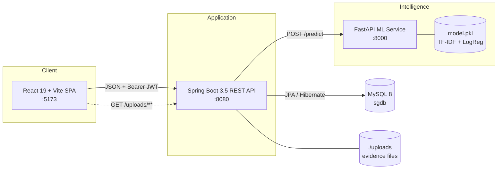
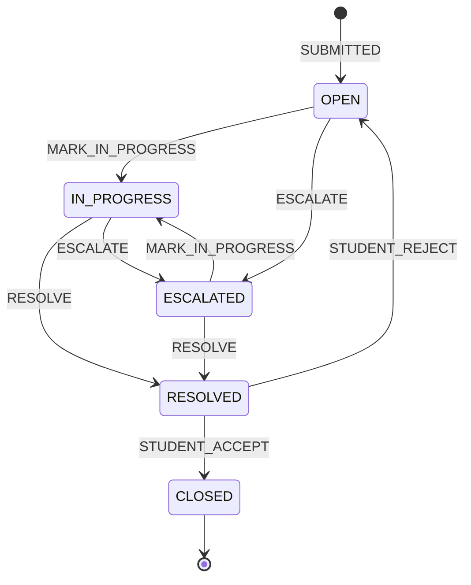
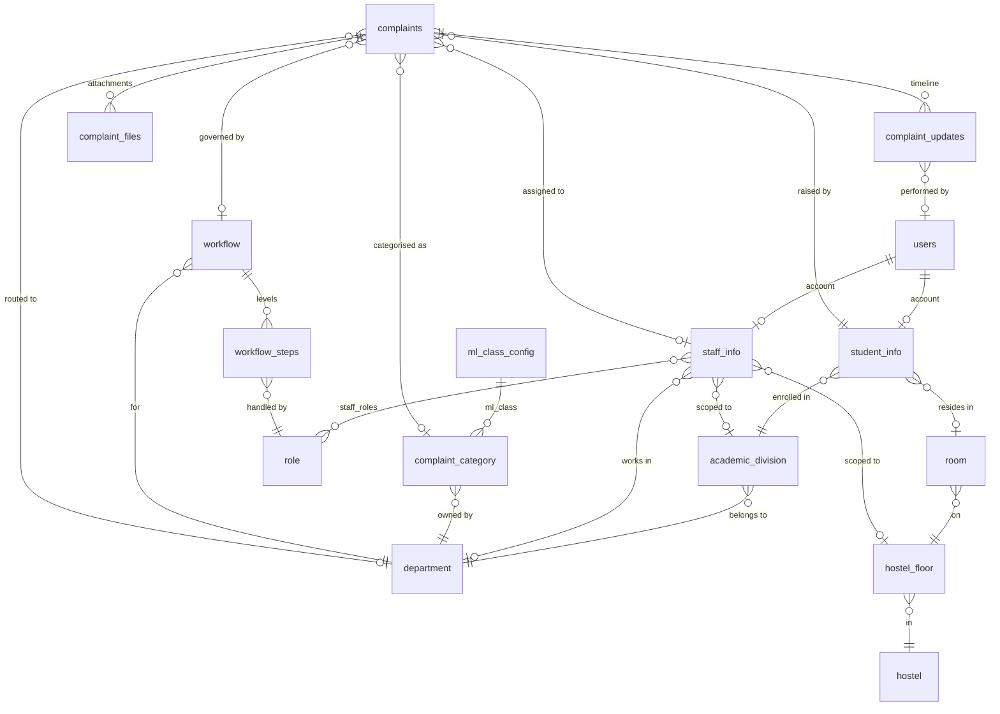

<div align="center">

# Smart Grievance Management System (SGMS)

**An ML-assisted grievance management platform for educational institutions.**

Students file complaints in plain language. A machine-learning classifier routes each complaint to the
right department, a configurable workflow engine assigns it to the right staff member, and every
action is recorded on an immutable audit timeline.

[](https://openjdk.org/projects/jdk/17/)
[](https://spring.io/projects/spring-boot)
[](https://react.dev/)
[](https://vite.dev/)
[](https://fastapi.tiangolo.com/)
[](https://scikit-learn.org/)
[](https://www.mysql.com/)

</div>

---

## Table of Contents

- [Overview](#overview)
- [Features](#features)
- [Architecture](#architecture)
- [Tech Stack](#tech-stack)
- [Repository Structure](#repository-structure)
- [Getting Started](#getting-started)
- [Configuration](#configuration)
- [API Reference](#api-reference)
- [ML Service](#ml-service)
- [Complaint Lifecycle](#complaint-lifecycle)
- [Data Model](#data-model)
- [Security Model](#security-model)
- [Testing](#testing)
- [Known Limitations](#known-limitations)
- [Roadmap](#roadmap)
- [Contributing](#contributing)
- [License](#license)

---

## Overview

Traditional grievance handling in colleges is manual: a student submits a form, a clerk decides which
department owns it, and the complaint disappears into an inbox with no visible status. SGMS replaces
that with a three-tier system:

1. **Classification** — a TF‑IDF + Logistic Regression model reads the complaint title and description
   and predicts an *ML class* (`HOSTEL`, `ACADEMIC`, `EXAM`, `LIBRARY`, `MEDICAL`, `TRANSPORT`,
   `SPORTS`, `ADMIN`) with a real confidence score.
2. **Resolution** — the backend resolves that class into a concrete `complaint_category` row using
   database-driven rules (`ml_class_config`), never hardcoded names. Low-confidence predictions fall
   back to explicit student selection.
3. **Routing & escalation** — each department owns a versioned workflow of levels. Every level names a
   role and an assignment scope (`DIVISION`, `DEPARTMENT`, `FLOOR`, `GLOBAL`), so the system can pick
   the exact staff member responsible — the warden of *that* hostel floor, the HOD of *that* division —
   and escalate up the chain when a level does not resolve in time.

Design principles that the codebase enforces:

- **The database is the single source of truth.** Category names, departments, ML class mappings and
  workflows are all data, not constants. Adding a department is a configuration change, not a release.
- **Degrade gracefully, never lose a complaint.** If the ML service is down, if no workflow is
  configured, or if no staff match the assignment scope, the complaint is still created and persisted —
  it simply stays unassigned and is visible to admins.
- **Everything is auditable.** Status transitions, escalations, admin overrides, staff reassignments and
  student accept/reject decisions are all appended to `complaint_updates` with actor, from-status,
  to-status and note.

---

## Features

### Student

- Submit a complaint with title, description, optional priority and up to five evidence files
  (JPEG / PNG / GIF / PDF, 5 MB each).
- **Live category suggestion** — request an ML prediction before submitting; the suggested category is
  auto-selected only when the model is confident, otherwise the student picks from the active category
  list.
- Track every complaint through its full status timeline.
- **Accept or reject a resolution.** Accepting closes the complaint; rejecting reopens it for the
  assigned staff member.

### Staff

- Dashboard of complaints assigned to *you* (scope-aware — enforced server-side, not just in the UI).
- Move a complaint to *In Progress*, resolve it, or attach a note — every action requires an audit note
  payload.
- **Escalate** to the next workflow level when the issue is outside your authority.

### Administrator

- Dashboard with live counts: students, staff, total / active / resolved / closed complaints.
- **Complaint oversight** — list all complaints, filter by status, priority or department; override a
  misrouted department (with a mandatory reason) and reassign staff manually.
- **Student & staff management** — provision accounts (created with a temporary password that the user
  must replace on first sign-in), update profiles, disable accounts.
- **Departments & categories** — create, update, activate/deactivate; bind a category to an ML class.
- **Workflow builder** — create versioned workflows per department, add/edit/delete levels with role and
  SLA (`resolutionTimeHours`), then activate a version atomically.

---

## Architecture



**Request path for a new complaint**

```
Student submits (multipart)
        │
        ├─ categoryId provided? ──► validate category + department are active   (no ML call)
        │
        └─ not provided? ────────► POST ml-service /predict
                                        │
                                        ├─ high_confidence ──► ml_class_config lookup
                                        │                      ├─ STUDENT_DEPT  → category of student's division
                                        │                      └─ DIRECT_SINGLE → the one active category for that class
                                        └─ low / unavailable ─► student must choose manually
        │
        ├─ resolve department from category
        ├─ load active workflow for department        (missing → complaint stays unassigned)
        ├─ assign staff for level 1 by role scope     (no match → complaint stays unassigned)
        ├─ persist complaint + ML audit metadata (predicted class, confidence, predicted priority)
        ├─ store evidence files
        └─ append SUBMITTED entry to the timeline
```

---

## Tech Stack

| Layer | Technology | Notes |
|---|---|---|
| Frontend | React 19, Vite 7, React Router 7 | SPA, `@` path alias to `src/` |
| UI | Tailwind CSS 4, shadcn/ui, Radix UI, Lucide, Framer Motion, Sonner | Component primitives under `src/components/ui` |
| HTTP client | Axios | Interceptors inject the JWT and force logout on `401` |
| Backend | Spring Boot 3.5.10, Java 17 | Web, Data JPA, Validation, Security |
| Auth | JJWT 0.11.5, BCrypt | Stateless HS256 tokens, 24 h default TTL |
| API docs | springdoc-openapi 2.7.0 | Bearer-auth security scheme pre-configured |
| Database | MySQL 8 + Hibernate | `ddl-auto=validate` — schema is managed outside the app |
| ML service | FastAPI 0.109, Uvicorn, Pydantic 2 | Two endpoints: `/health`, `/predict` |
| ML model | scikit-learn — TF‑IDF (1–2 grams) → Logistic Regression (`C=5.0`) | Persisted with joblib as `model.pkl` |
| Build | Maven Wrapper, npm, pip | |

---

## Repository Structure

```
smart-grievance-system/
├── backend/sgms-backend/            Spring Boot REST API
│   └── src/main/java/com/sgms/sgms_backend/
│       ├── config/                  Swagger + static upload resource handler
│       ├── controller/              16 REST controllers
│       ├── dto/                     Request/response payloads (grouped by domain)
│       ├── enums/                   ComplaintStatus, ComplaintAction, Priority, AssignmentScope, …
│       ├── exception/               Typed exceptions + @RestControllerAdvice
│       ├── model/                   17 JPA entities
│       ├── repository/              Spring Data repositories
│       ├── security/                JwtFilter, JwtUtil, SecurityConfig, CorsConfig
│       └── service/
│           ├── assignment/          Scope-based staff selection
│           ├── resolution/          ML class → category resolution
│           ├── workflow/            Workflow + step lookup
│           ├── timeline/            Audit trail writer
│           └── impl/                Service implementations
├── frontend/                        React + Vite SPA
│   └── src/
│       ├── components/              admin/, complaints/, dashboard/, ui/
│       ├── context/UserContext.jsx  Session bootstrap via /auth/me
│       ├── pages/                   Dashboards, complaint flow, admin/ management screens
│       ├── routes/                  AppRoutes + role-aware ProtectedRoute
│       └── services/                One Axios module per API surface
├── ml-service/                      FastAPI classification microservice
│   ├── main.py                      HTTP layer (/health, /predict)
│   ├── model.py                     Lazy-loaded inference + confidence gating
│   ├── preprocess.py                Shared text pipeline (train == inference)
│   ├── train.py                     Train, evaluate, persist model.pkl
│   ├── dataset.csv                  10,315-row seed dataset (8 classes)
│   ├── test_model.py, diagnose.py   Manual prediction smoke scripts
│   └── requirements.txt
├── database/sgms.sql                Legacy schema fragment — see Getting Started
└── docs/                            Documentation
```

---

## Getting Started

### Prerequisites

| Tool | Version |
|---|---|
| JDK | 17+ |
| Node.js | 20+ (npm 10+) |
| Python | 3.10+ |
| MySQL | 8.0+ |

### 1. Clone

```bash
git clone https://github.com/your-username/smart-grievance-system.git
```

### 2. Database

Create the database:

```bash
mysql -u root -p -e "CREATE DATABASE IF NOT EXISTS sgdb CHARACTER SET utf8mb4;"
```

> **Note on the schema.** The backend runs with `spring.jpa.hibernate.ddl-auto=validate`, which
> requires the schema to already match the JPA entities — Hibernate will not create it. The committed
> `database/sgms.sql` is an early fragment (only `student_info` and `staff_info`) and does **not** match
> the current entity model. To generate a schema for local development, start the backend once with
> `-Dspring.jpa.hibernate.ddl-auto=update`, then dump it and switch back to `validate`:
>
> ```bash
> mysqldump --no-data -u root -p sgdb > database/schema.sql
> ```

The system is configuration-driven, so a working environment needs reference data seeded before the
first complaint can be routed:

| Table | Purpose |
|---|---|
| `department` | One row per owning department (`code`, `name`, `active`) |
| `academic_division` | Divisions/branches, optionally linked to a department |
| `role` | Staff roles with an `assignment_scope` |
| `ml_class_config` | One row per ML class → `STUDENT_DEPT` or `DIRECT_SINGLE` |
| `complaint_category` | Student-facing categories, each bound to a department and an `ml_class` |
| `workflow` + `workflow_steps` | One active workflow per department, levels with role + SLA |
| `hostel`, `hostel_floor`, `room` | Required for `FLOOR`-scoped routing |
| `users` + `staff_info` + `role` mapping | At least one staff account holding the `ADMIN` role |

Generate a BCrypt hash for a bootstrap account with the bundled helper:

```bash
cd backend/sgms-backend && ./mvnw -q compile exec:java -Dexec.mainClass=com.sgms.sgms_backend.util.PasswordGenerator -Dexec.args=yourPassword
```

### 3. ML service

```bash
cd ml-service && python -m venv venv && source venv/Scripts/activate && pip install -r requirements.txt && python train.py && uvicorn main:app --host 127.0.0.1 --port 8000
```

On Linux/macOS use `source venv/bin/activate`. `train.py` prints dataset statistics, hold-out accuracy,
a per-class report, a confusion matrix and k-fold cross-validation scores, then writes `model.pkl`.

Verify:

```bash
curl http://127.0.0.1:8000/health
```

### 4. Backend

```bash
cd backend/sgms-backend && cp .env.example .env && ./mvnw spring-boot:run -Dspring-boot.run.profiles=dev
```

The `dev` profile supplies working defaults for every property, so it runs without exported environment
variables. For any non-local run, use the default profile and provide the variables from
[Configuration](#configuration) — it has **no** fallback for the datasource or the JWT secret, which is
deliberate.

API base URL: `http://localhost:8080`

### 5. Frontend

```bash
cd frontend && cp .env.example .env.local && npm install && npm run dev
```

Open `http://localhost:5173`.

| Script | Description |
|---|---|
| `npm run dev` | Vite dev server with HMR |
| `npm run build` | Production build to `dist/` |
| `npm run preview` | Serve the production build |
| `npm run lint` | ESLint over the project |

---

## Configuration

All three services read configuration from the environment. Copy each `.env.example` and never commit
real credentials — `.gitignore` already excludes `*.env` and `.env.*`.

### Backend — `backend/sgms-backend/.env`

| Variable | Default (`dev` profile) | Description |
|---|---|---|
| `PORT` | `8080` | HTTP port |
| `DATASOURCE_URL` | `jdbc:mysql://localhost:3306/sgdb` | JDBC URL |
| `DATASOURCE_USER` | `root` | Database user |
| `DATASOURCE_PASSWORD` | *(empty)* | Database password |
| `JWT_SECRET` | dev-only key | HS256 signing key — **must be ≥ 256 bits in production** |
| `JWT_EXPIRATION_MS` | `86400000` | Token TTL (24 h) |
| `ML_API_URL` | `http://127.0.0.1:8000/predict` | ML prediction endpoint |
| `ML_CONFIDENCE_THRESHOLD` | `0.60` | Minimum confidence for auto-selecting a category |
| `CORS_ALLOWED_ORIGINS` | `http://localhost:5173` | Comma-separated allowed origins |

### Frontend — `frontend/.env.local`

| Variable | Default | Description |
|---|---|---|
| `VITE_API_BASE_URL` | `http://localhost:8080` | Backend base URL |

> Only `VITE_`-prefixed variables reach the browser. Never place secrets here.

### ML service — `ml-service/.env`

| Variable | Default | Description |
|---|---|---|
| `HOST` | `127.0.0.1` | Bind address |
| `PORT` | `8000` | HTTP port |
| `MODEL_PATH` | `model.pkl` | Serialised pipeline location |
| `CONFIDENCE_THRESHOLD` | `0.60` | High-confidence cutoff |
| `LOG_LEVEL` | `INFO` | Logging verbosity |

> Keep `ML_CONFIDENCE_THRESHOLD` (backend) and `CONFIDENCE_THRESHOLD` (ML service) in sync — the
> backend applies its own threshold when resolving a suggestion.

---

## API Reference

Base URL `http://localhost:8080`. Every endpoint except `POST /auth/login`, `POST /auth/signin` and
`GET /uploads/**` requires `Authorization: Bearer <token>`. Roles below are enforced with
`@PreAuthorize` on the controller methods.

### Authentication

| Method | Endpoint | Access | Description |
|---|---|---|---|
| `POST` | `/auth/login` | Public | Exchange email + password for a JWT (`{ token, role, userType }`) |
| `POST` | `/auth/signin` | Public | First-time activation: replaces the temporary password, then logs in |
| `GET` | `/auth/me` | Authenticated | Current user profile with the student or staff sub-profile |

### Complaints — Student

| Method | Endpoint | Access | Description |
|---|---|---|---|
| `POST` | `/complaints/predict` | `STUDENT` | Suggest a category from `{ title, complaint_text }` |
| `POST` | `/complaints` | `STUDENT` | Create a complaint — `multipart/form-data` with a `request` part and optional `files` parts |
| `GET` | `/complaints/my` | `STUDENT` | Own complaints |
| `GET` | `/complaints/{id}` | `STUDENT` `STAFF` `ADMIN` | Complaint detail with timeline and attachments |
| `POST` | `/complaints/{id}/feedback?accepted={bool}` | `STUDENT` | Accept (→ `CLOSED`) or reject (→ `OPEN`) a resolution |
| `GET` | `/complaints/categories` | Authenticated | Active categories with department names |

### Complaints — Staff

| Method | Endpoint | Access | Description |
|---|---|---|---|
| `GET` | `/complaints/assigned` | `STAFF` `ADMIN` | Complaints assigned to the caller |
| `PATCH` | `/complaints/{id}/status?action={ComplaintAction}` | `STAFF` `ADMIN` | Apply a workflow action with an audit note |
| `PATCH` | `/complaints/{id}/escalate` | `STAFF` `ADMIN` | Escalate to the next workflow level |
| `GET` | `/complaints/student/{studentId}` | `STAFF` `ADMIN` | Complaint history for one student |

### Complaints — Admin

| Method | Endpoint | Description |
|---|---|---|
| `GET` | `/complaints` | All complaints |
| `GET` | `/complaints/status/{status}` | Filter by `OPEN` \| `IN_PROGRESS` \| `ESCALATED` \| `RESOLVED` \| `CLOSED` |
| `GET` | `/complaints/priority/{priority}` | Filter by `LOW` \| `MEDIUM` \| `HIGH` \| `CRITICAL` |
| `GET` | `/complaints/department/{departmentId}` | Filter by department |
| `PATCH` | `/complaints/{id}/assign/{staffId}` | Assign a specific staff member |
| `PATCH` | `/complaints/{id}/override-department` | Re-route to another department — `note` is mandatory |
| `PATCH` | `/complaints/{id}/reassign-staff` | Manual staff reassignment |

### Administration

| Method | Endpoint | Description |
|---|---|---|
| `GET` | `/admin/dashboard`, `/admin/dashboard/stats` | Aggregate counts |
| `POST` `GET` | `/admin/students` | Create / list students |
| `GET` `PUT` | `/admin/students/{id}` | Read / update a student |
| `PATCH` | `/admin/students/{id}/disable` | Disable a student account |
| `POST` `GET` | `/admin/staff` | Create / list staff |
| `GET` `PUT` | `/admin/staff/{id}` | Read / update a staff member |
| `PATCH` | `/admin/staff/{id}/disable` | Disable a staff account |
| `GET` | `/admin/staff/by-department/{departmentId}` | Staff filtered by department |
| `POST` `GET` | `/admin/departments` | Create / list departments |
| `GET` `PUT` | `/admin/departments/{id}` | Read / update a department |
| `PATCH` | `/admin/departments/{id}/status` | Activate / deactivate |
| `POST` `GET` | `/admin/categories` | Create / list categories |
| `GET` | `/admin/categories/by-department/{departmentId}` | Categories of one department |
| `GET` `PUT` | `/admin/categories/{id}` | Read / update a category |
| `PATCH` | `/admin/categories/{id}/status` | Activate / deactivate |
| `POST` `GET` | `/admin/workflows/department/{departmentId}` | Create / list workflow versions |
| `GET` | `/admin/workflows/{id}` | Workflow with its steps |
| `POST` | `/admin/workflows/{workflowId}/steps` | Add a level |
| `PUT` `DELETE` | `/admin/workflows/steps/{stepId}` | Update / remove a level |
| `POST` | `/admin/workflows/{workflowId}/activate` | Activate this version |
| `GET` | `/admin/workflows/roles` | Roles available for workflow levels |

### Reference data

| Method | Endpoint | Access | Description |
|---|---|---|---|
| `GET` | `/departments` | `ADMIN` `STAFF` `STUDENT` | Departments |
| `GET` | `/divisions` | Authenticated | Academic divisions |
| `GET` | `/floors` | Authenticated | Hostel floors |
| `GET` | `/rooms` | Authenticated | Rooms |
| `GET` | `/roles`, `/roles/staff` | Authenticated | Roles |
| `GET` | `/complaint-categories` | Authenticated | Categories |
| `GET` | `/student/dashboard` | `STUDENT` | Student dashboard payload |
| `GET` | `/staff/dashboard` | `STAFF` `ADMIN` | Staff dashboard payload |

### Example — end-to-end submission

```bash
TOKEN=$(curl -s -X POST http://localhost:8080/auth/login -H 'Content-Type: application/json' -d '{"email":"student@college.edu","password":"secret"}' | jq -r .token)
```

```bash
curl -s -X POST http://localhost:8080/complaints/predict -H "Authorization: Bearer $TOKEN" -H 'Content-Type: application/json' -d '{"title":"No water in hostel","complaint_text":"There has been no water supply on our floor for three days."}'
```

```json
{
  "categoryId": 4,
  "categoryName": "Hostel Maintenance",
  "departmentName": "HOSTEL",
  "mlClass": "HOSTEL",
  "confidenceScore": 0.8742,
  "highConfidence": true,
  "suggestionNote": "Suggested from ML classification"
}
```

```bash
curl -s -X POST http://localhost:8080/complaints -H "Authorization: Bearer $TOKEN" -F 'request={"title":"No water in hostel","description":"There has been no water supply on our floor for three days.","categoryId":4};type=application/json' -F 'files=@evidence.jpg'
```

### OpenAPI

A springdoc `OpenAPI` bean with a `bearerAuth` security scheme is configured in
`config/SwaggerConfig.java`, exposing `/v3/api-docs` and `/swagger-ui/index.html`. See
[Known Limitations](#known-limitations) — the security chain currently authenticates these paths too.

---

## ML Service

### Endpoints

| Method | Endpoint | Description |
|---|---|---|
| `GET` | `/health` | Service status, `model_loaded`, active confidence threshold |
| `POST` | `/predict` | `{ title, complaint_text }` → `{ predicted_class, confidence, high_confidence, predicted_priority }` |

### Pipeline

```
title + description
   → combine_fields()      title weighted 2× (strongest routing signal)
   → clean_text()          NFKD unicode normalise → ASCII → lowercase
                           → strip non-alphabetic → collapse whitespace
                           → remove a minimal stopword set
   → TfidfVectorizer       ngram_range=(1,2), min_df=1, max_df=0.95, sublinear_tf
   → LogisticRegression    C=5.0, lbfgs, max_iter=1000
   → predict_proba()       argmax class + real probability
```

`preprocess.py` is imported by both `train.py` and `model.py`, so training and inference are guaranteed
to share the same feature extraction. Domain terms (`hostel`, `exam`, `library`, `transport`, `medical`,
`sports`, `academic`) are deliberately kept out of the stopword list.

### Dataset

`dataset.csv` — 10,315 labelled rows across 8 classes:

| Class | Rows | Share |
|---|---:|---:|
| `ADMIN` | 3,133 | 30.4 % |
| `HOSTEL` | 2,120 | 20.6 % |
| `ACADEMIC` | 1,983 | 19.2 % |
| `MEDICAL` | 953 | 9.2 % |
| `LIBRARY` | 728 | 7.1 % |
| `EXAM` | 509 | 4.9 % |
| `TRANSPORT` | 445 | 4.3 % |
| `SPORTS` | 444 | 4.3 % |

> This is a **seed / development dataset**, and `train.py` says so on every run. Metrics it reports
> describe performance on synthetic seed data and are not a claim about production accuracy. Retrain on
> real historical grievances before drawing conclusions.

### Confidence gating

`confidence >= CONFIDENCE_THRESHOLD` (default `0.60`) sets `high_confidence: true`. Only then does the
frontend auto-select the suggested category; below the threshold the student chooses manually. Both the
raw prediction and its confidence are persisted on the complaint (`ml_predicted_category`,
`ml_confidence`, `ml_predicted_priority`) so routing decisions stay reviewable.

Priority is **not** modelled — the service returns `MEDIUM` as a safe default (`LOW` for empty input),
and the student's own priority selection takes precedence.

### Retraining

```bash
cd ml-service && python train.py
```

Smoke-test predictions without starting the server:

```bash
cd ml-service && python test_model.py
```

---

## Complaint Lifecycle



`UPDATE_NOTE`, `ADMIN_OVERRIDE` and `STAFF_REASSIGN` are timeline-only actions — they record an audit
entry without changing status.

### Assignment scopes

A workflow level names a role, and the role's `assignment_scope` decides *which* holder of that role
receives the complaint:

| Scope | Resolution |
|---|---|
| `DIVISION` | Staff with the role in the student's academic division |
| `DEPARTMENT` | Staff with the role in the complaint's department |
| `FLOOR` | Staff with the role on the student's hostel floor; falls back to `DEPARTMENT` when the student has no room |
| `GLOBAL` | The first staff member holding the role, institution-wide |

Escalation increments `current_level` and re-runs the lookup against the next workflow step. If any
lookup fails, the failure is logged and the complaint remains unassigned rather than being rejected.

---

## Data Model



**Notable columns**

- `users` — `account_type` (`STUDENT` \| `STAFF`), `is_temp_password`, `enabled`, `last_login`.
  `ADMIN` is not an account type; it is a staff *role*.
- `complaints` — `current_level`, `escalation_level`, `priority`, `status`, `admin_override_note`,
  `resolved_at`, plus the three `ml_*` audit columns.
- `complaint_updates` — `action`, `from_status`, `to_status`, `note`, `performed_by`, `created_at`:
  the append-only audit log.
- `ml_class_config` — `ml_class` (PK), `resolution_type` (`STUDENT_DEPT` \| `DIRECT_SINGLE`), `active`.
- `workflow` — `(department, version)` with a single `active` version per department.

---

## Security Model

- **Stateless JWT.** `SessionCreationPolicy.STATELESS`, no server-side session. `JwtFilter` runs before
  `UsernamePasswordAuthenticationFilter`, parses the bearer token and grants `ROLE_<accountType>` plus
  `ROLE_<staffRole>` — this second authority is what makes `hasRole('ADMIN')` work for staff who hold
  the `ADMIN` role.
- **Invalid tokens fail closed, not loud.** A malformed or expired token is logged and the request
  continues unauthenticated, so Spring Security rejects it instead of returning a 500.
- **Passwords** are BCrypt-hashed. Provisioned accounts start with a temporary password and
  `is_temp_password = true`; `POST /auth/signin` is the only way to clear that flag, and login is
  refused for disabled accounts.
- **Method-level authorisation** via `@EnableMethodSecurity` and `@PreAuthorize` on every controller
  method — the frontend's `ProtectedRoute` is a UX convenience, not the security boundary.
- **Ownership checks.** Staff endpoints verify the complaint is actually assigned to the caller; students
  can only read their own complaints.
- **File upload hardening** in `ComplaintFileService`: MIME allow-list (JPEG, PNG, GIF, PDF), 5 MB per
  file, filenames stripped of path separators and unsafe characters, then stored under a generated UUID.
- **CORS** is driven by `CORS_ALLOWED_ORIGINS` — an explicit origin list, not a wildcard.
- **Validation** with Jakarta Bean Validation on request DTOs; `GlobalExceptionHandler` maps
  `NotFoundException`, `ValidationException` and `ForbiddenException` to consistent `ErrorResponse`
  payloads.

---

## Testing

### Backend

```bash
cd backend/sgms-backend && ./mvnw test
```

70 JUnit 5 test methods across 7 classes:

| Class | Focus |
|---|---|
| `ComplaintServiceImplTest` | Complaint creation, ML fallback, status transitions, feedback |
| `CategoryResolutionServiceTest` | `STUDENT_DEPT` / `DIRECT_SINGLE` resolution, cardinality and active-state guards |
| `Phase2VerificationTest`, `Phase10B/C/DVerificationTest` | Milestone regression suites |
| `SgmsBackendApplicationTests` | Context load |

### ML service

`test_model.py`, `test_preprocess.py` and `diagnose.py` are executable scripts (not a pytest suite) that
print predictions and confidences for a fixed set of representative complaints — useful for eyeballing
class confusion after a retrain:

```bash
cd ml-service && python test_model.py && python test_preprocess.py && python diagnose.py
```

### Frontend

```bash
cd frontend && npm run lint
```

---

## Known Limitations

Documented deliberately — these are the rough edges a new contributor will hit first.

| Area | Issue | Suggested fix |
|---|---|---|
| Database | `database/sgms.sql` is a legacy fragment that does not match the JPA entities, while `ddl-auto=validate` refuses to create the schema. A fresh clone cannot start against an empty database. | Commit a generated schema plus a reference-data seed script |
| Swagger | `SecurityConfig` permits only `/auth/**` and `/uploads/**`, so `/swagger-ui/**` and `/v3/api-docs/**` require a bearer token and the UI cannot load in a browser. | Add those two matchers to `permitAll()` (dev profile only) |
| Auth errors | `AuthServiceImpl` throws bare `RuntimeException` for unknown user, bad credentials and disabled account, which surfaces as `500` rather than `401`/`403`. | Use the project's typed exceptions and map them in `GlobalExceptionHandler` |
| Attachments | Files are written to a local `./uploads` directory, so the API is not horizontally scalable as-is. | Move to object storage (S3-compatible) |
| Escalation | Escalation resolves staff via `findFirstByRolesContains`, ignoring the role's `assignment_scope` — unlike initial assignment. | Reuse `ComplaintAssignmentService.assignStaff` for escalation |
| SLA | `workflow_steps.resolutionTimeHours` is stored but no scheduler auto-escalates on breach; escalation is manual. | Add a scheduled breach sweep |
| Notifications | No email or push delivery; temporary passwords must be communicated out of band. | Add a mail service on account creation and status change |
| ML priority | Priority is not modelled — the service always returns `MEDIUM`. | Train a second head, or drop the field from the contract |

---

## Roadmap

- [ ] Committed schema + idempotent seed migration (Flyway or Liquibase)
- [ ] Email notifications for provisioning, assignment and resolution
- [ ] Scheduled SLA breach detection with automatic escalation
- [ ] Analytics dashboard: resolution times, per-department load, escalation rates
- [ ] Retrain the classifier on real historical grievances and publish an honest evaluation
- [ ] Refresh tokens and password reset
- [ ] Object storage for attachments
- [ ] Docker Compose for the full stack
- [ ] CI pipeline running backend tests, frontend lint and an ML smoke test

---

## Contributing

1. Fork the repository and branch from `develop`:
   `git checkout -b feature/your-feature`
2. Keep the existing layering — controllers stay thin, business logic lives in `service/`, and
   cross-cutting concerns get their own package (`assignment`, `resolution`, `workflow`, `timeline`).
3. **No hardcoded department, category or role names.** Anything institution-specific belongs in the
   database.
4. Add tests for new behaviour and keep `./mvnw test` and `npm run lint` green.
5. Never commit `.env` files, credentials, or a retrained `model.pkl` without noting the dataset it came
   from.
6. Open a pull request against `develop` describing the change and how you verified it.

---

## License

No license file is currently present in this repository. Until one is added, the work is "all rights
reserved" by default and cannot be reused by others. Add a `LICENSE` file — MIT or Apache-2.0 for an
open project — to make the terms explicit.

---

<div align="center">
Built with Spring Boot, React and scikit-learn.
</div>
